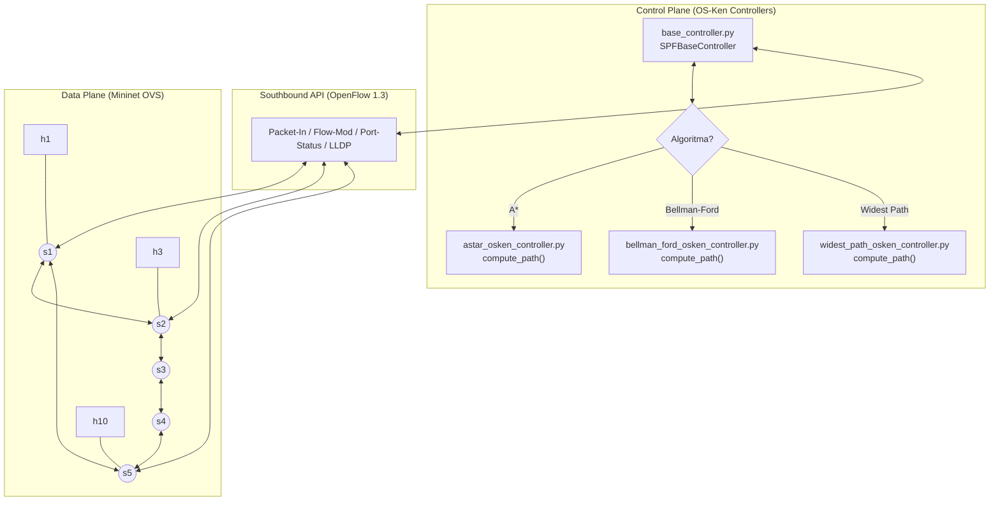
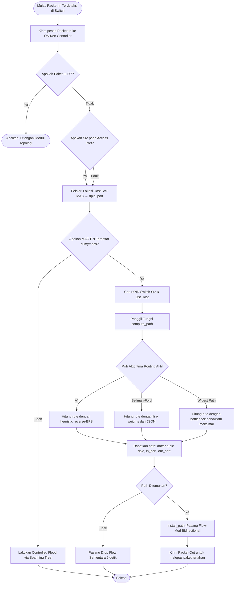
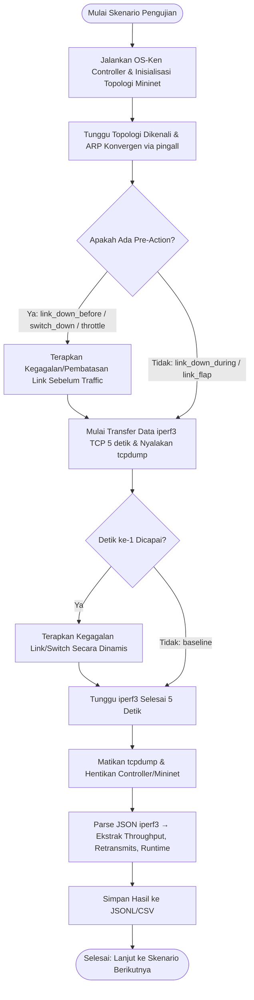
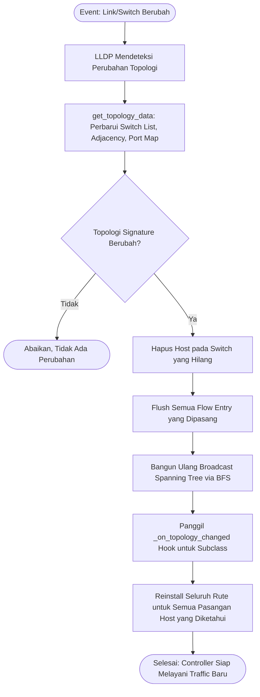

# 5. Perancangan Sistem

Bab ini memaparkan arsitektur teknis sistem, diagram alir proses utama, dan desain antarmuka CLI yang digunakan untuk menjalankan pengujian. Seluruh diagram dibuat menggunakan **Mermaid syntax** yang ter-render otomatis di Markdown.

---

## 5.1 Arsitektur Jaringan Solusi (OS-Ken & Mininet)

Sistem ini menggunakan arsitektur SDN klasik dengan pemisahan tegas antara *control plane* (OS-Ken Controller) dan *data plane* (Mininet Open vSwitch). Komunikasi antara kedua bidang dilakukan melalui protokol OpenFlow 1.3 (*southbound API*).

Berikut adalah diagram arsitektur integrasi sistem:



**Penjelasan arsitektur:**
*   **Control Plane**: `SPFBaseController` merupakan kelas induk yang menangani seluruh interaksi OpenFlow (Packet-In, Flow-Mod, LLDP processing). Tiga subclass algoritmik masing-masing hanya perlu mengimplementasikan `compute_path()`, yaitu fungsi yang menerima switch sumber, switch tujuan, dan port akses, lalu mengembalikan daftar tuple `(dpid, in_port, out_port)`.
*   **Southbound API**: Pesan OpenFlow 1.3 yang mengalir antara controller dan switch meliputi: *Packet-In* (paket tanpa flow rule dikirim ke controller), *Flow-Mod* (controller memasang/menghapus flow rule), *Port-Status* (notifikasi perubahan status port), dan *LLDP* (deteksi topologi).
*   **Data Plane**: Contoh di atas menunjukkan topologi Ring-5 dengan 5 switch (s1–s5) yang terhubung melingkar. Setiap switch memiliki 2 host yang terhubung melalui *access port*. Topologi Jellyfish memiliki 10 switch dengan koneksi acak regular (seed 42).

---

## 5.2 Diagram Alir / Alur Proses (Flowchart)

### A. Alur Pemrosesan *Packet-In* & Rerouting Dinamis

Diagram berikut menjelaskan logika pengendali saat menerima paket baru yang belum memiliki aturan aliran (*flow rules*) di switch:



**Penjelasan alur:**
1. Setiap paket tanpa flow rule memicu *Packet-In* ke controller.
2. Paket LLDP langsung diabaikan (ditangani modul topologi terpisah).
3. Lokasi host sumber dipelajari hanya dari *access port* (bukan inter-switch port).
4. Jika MAC tujuan diketahui, controller memanggil `compute_path()` sesuai algoritma aktif.
5. Jika tidak ada jalur (misalnya switch tujuan terputus), *drop flow* sementara dipasang selama 5 detik untuk mencegah *Packet-In storm*.
6. Flow dipasang secara **bidirectional** (baik arah maju maupun balik) pada setiap switch di sepanjang jalur.

---

### B. Alur Eksekusi Otomatisasi Testbed Gangguan (*Resilience Run*)

Diagram berikut menjelaskan alur kerja skrip pengujian `run_live_scenarios.py` saat menjalankan satu skenario kegagalan:



**Penjelasan alur:**
1. Setiap iterasi skenario memulai pengendali OS-Ken dan topologi Mininet dari nol (*clean state*).
2. Setelah topologi konvergen (diverifikasi melalui pingall), skenario kegagalan diterapkan sesuai jenisnya:
   *   **Pre-action** (link_down_before, switch_down, bandwidth_throttle): kegagalan diterapkan *sebelum* traffic dimulai.
   *   **During-action** (link_down_during, link_flap): kegagalan diterapkan 1 detik *setelah* traffic dimulai.
3. Transfer data TCP iperf3 berjalan selama 5 detik per pasangan host.
4. Hasil dikumpulkan dalam format JSONL, kemudian dikonversi ke CSV untuk analisis Jupyter Notebook.

---

### C. Alur Rerouting Otomatis Pasca-Kegagalan Topologi

Diagram berikut menjelaskan mekanisme internal controller saat topologi berubah akibat kegagalan link/switch:



**Penjelasan mekanisme:**
1. Perubahan topologi dideteksi melalui event LLDP dan divalidasi menggunakan *topology signature* (hash dari daftar switch dan link) untuk menghindari pemrosesan duplikat.
2. Seluruh flow entry lama di-flush untuk mencegah *stale routing*.
3. Spanning tree dibangun ulang untuk memastikan controlled flooding tetap berfungsi.
4. Seluruh rute yang diketahui dihitung ulang secara proaktif menggunakan algoritma aktif, **tanpa menunggu Packet-In baru**.

---

## 5.3 Desain Antarmuka (CLI & Konfigurasi)

Sistem pengujian dijalankan melalui CLI (Command Line Interface) berbasis terminal Linux. Berikut adalah skema perintah utama:

```bash
python3 SPF/testing-code/run_live_scenarios.py \
  --topologies [ring5 | jellyfish] \
  --algorithms [astar | bellman_ford | widest_path] \
  --scenarios [baseline_no_failure | link_down_before_traffic | \
               link_down_during_traffic | link_flap | switch_down | \
               bandwidth_throttle | random_link_down_jellyfish] \
  --max-pairs 20 \
  --repetitions 5 \
  --pcap-dir [Direktori Output PCAP] \
  --output [Berkas Hasil JSONL]
```

**Parameter penting:**
| Parameter | Nilai Eksperimen | Penjelasan |
| :--- | :---: | :--- |
| `--max-pairs` | 20 | Jumlah pasangan host acak yang diuji per skenario |
| `--repetitions` | 5 | Jumlah pengulangan per pasangan host |
| `--topologies` | ring5, jellyfish | Dua topologi yang dibandingkan |
| `--algorithms` | astar, bellman_ford, widest_path | Tiga algoritma yang dievaluasi |
| `--scenarios` | 7 jenis | Baseline + 6 skenario kegagalan |

Konfigurasi bobot kapasitas link statis dibaca oleh controller dari berkas `link_weights.json`. File ini mendefinisikan bandwidth (dalam Mbps) untuk setiap link antar-switch, yang digunakan oleh Bellman-Ford sebagai cost dan oleh Widest Path sebagai kapasitas.
