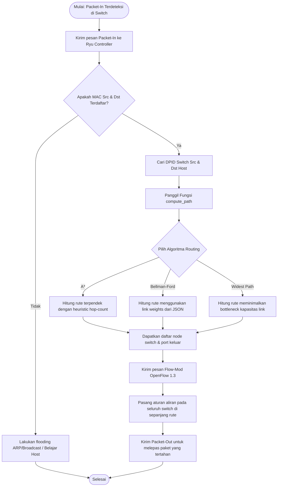
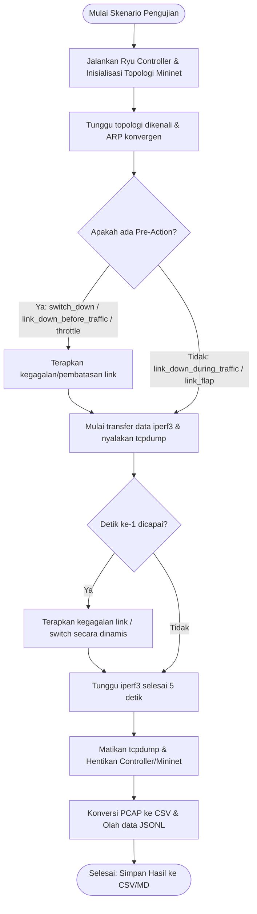

# 5. Perancangan Sistem

> [!TIP]
> **PANDUAN RUBRIK PENILAIAN - KRITERIA 2 (Skor Maksimal: 5/5):**
> Untuk mendapatkan skor maksimal, perancangan sistem Anda harus logis, didukung diagram alir proses (*flowchart*), dan arsitektur yang terperinci. 
> Dokumen ini menyediakan template diagram menggunakan **Mermaid syntax** yang akan ter-render otomatis di Markdown. Pastikan Anda menjelaskan arti dari masing-masing diagram alir tersebut secara terperinci di laporan akhir Anda.

---

## 5.1 Arsitektur Jaringan Solusi (Ryu & Mininet)
Sistem ini menggunakan arsitektur SDN klasik dengan pemisahan *control plane* (Ryu) dan *data plane* (Mininet Open vSwitch). Berikut adalah diagram arsitektur integrasi sistem:

```mermaid
graph TD
    subgraph Control Plane (Ryu Controllers)
        ryu_base[base_controller.py] <--> algo_switch{Algoritma?}
        algo_switch -->|A*| c_astar[astar_osken_controller.py]
        algo_switch -->|Bellman-Ford| c_bf[bellman_ford_osken_controller.py]
        algo_switch -->|Widest Path| c_wp[widest_path_osken_controller.py]
    end

    subgraph Southbound API (OpenFlow 1.3)
        ctrl_msg[Packet-In / Flow-Mod / Port-Status]
    end

    subgraph Data Plane (Mininet OVS)
        s1((s1)) <--> s2((s2))
        s2 <--> s3((s3))
        s3 <--> s4((s4))
        s4 <--> s5((s5))
        s5 <--> s1((s1))
        
        h1[h1] --- s1
        h3[h3] --- s2
        h10[h10] --- s5
    end

    ryu_base <--> ctrl_msg
    ctrl_msg <--> s1
    ctrl_msg <--> s2
    ctrl_msg <--> s5
```

---

## 5.2 Diagram Alir / Alur Proses (Flowchart)

### A. Alur Pemrosesan *Packet-In* & Rerouting Dinamis
Diagram berikut menjelaskan logika pengendali saat menerima paket baru yang belum memiliki aturan aliran (*flow rules*) di switch:



---

### B. Alur Eksekusi Otomatisasi Testbed Gangguan (*Resilience Run*)
Diagram berikut menjelaskan alur kerja skrip pengujian [run_live_scenarios.py](file:///c:/Users/anang/OneDrive/Documents/GitHub/learn_sdn/SPF/testing-code/run_live_scenarios.py) saat menjalankan skenario kegagalan:



---

## 5.3 Desain Antarmuka (CLI & Konfigurasi)
Sistem pengujian dijalankan melalui CLI (Command Line Interface) berbasis terminal Linux dengan skema antarmuka perintah sebagai berikut:

```bash
python3 SPF/testing-code/run_live_scenarios.py \
  --topologies [ring5 | jellyfish] \
  --algorithms [astar | bellman_ford | widest_path] \
  --scenarios [baseline_no_failure | link_down_before_traffic | link_down_during_traffic | link_flap | switch_down | bandwidth_throttle | random_link_down_jellyfish] \
  --max-pairs [Jumlah Pasang Host] \
  --repetitions [Pengulangan] \
  --pcap-dir [Direktori Output PCAP] \
  --output [Berkas Hasil JSONL]
```

Konfigurasi bobot kapasitas link statis dibaca oleh controller dari berkas [link_weights.json](file:///c:/Users/anang/OneDrive/Documents/GitHub/learn_sdn/SPF/link_weights.json).
