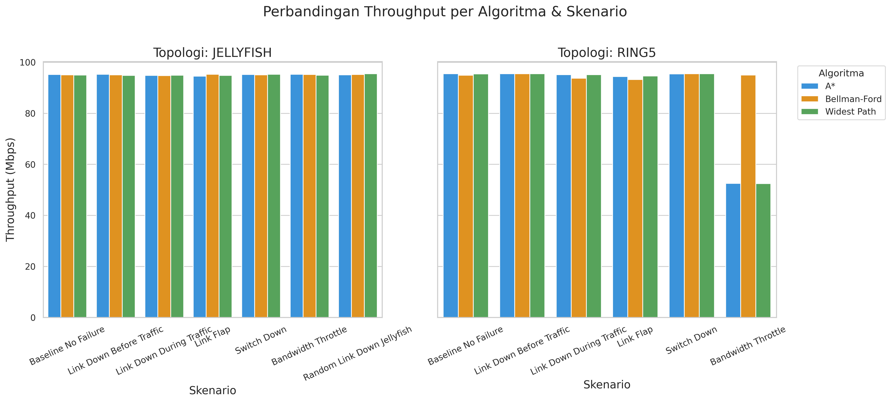
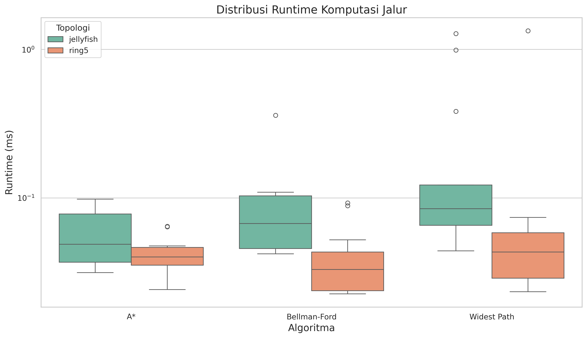
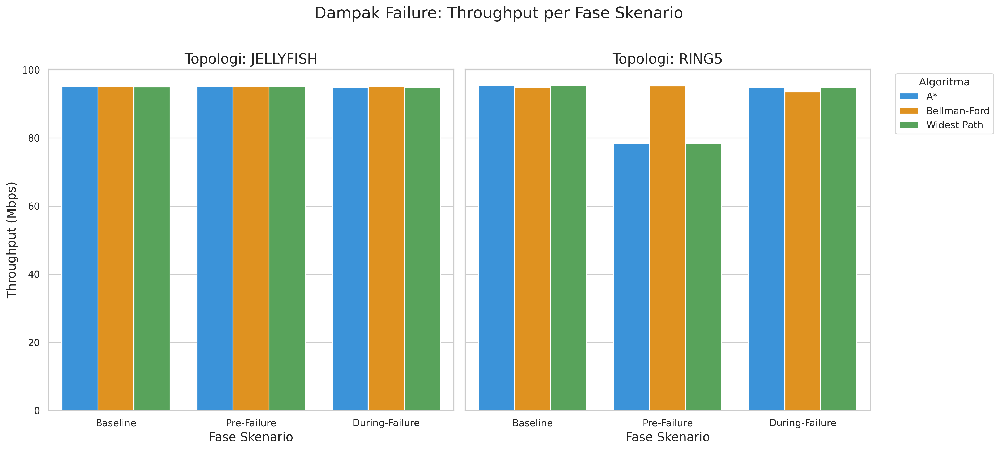
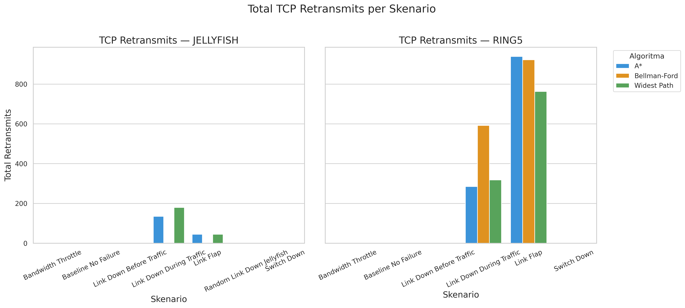
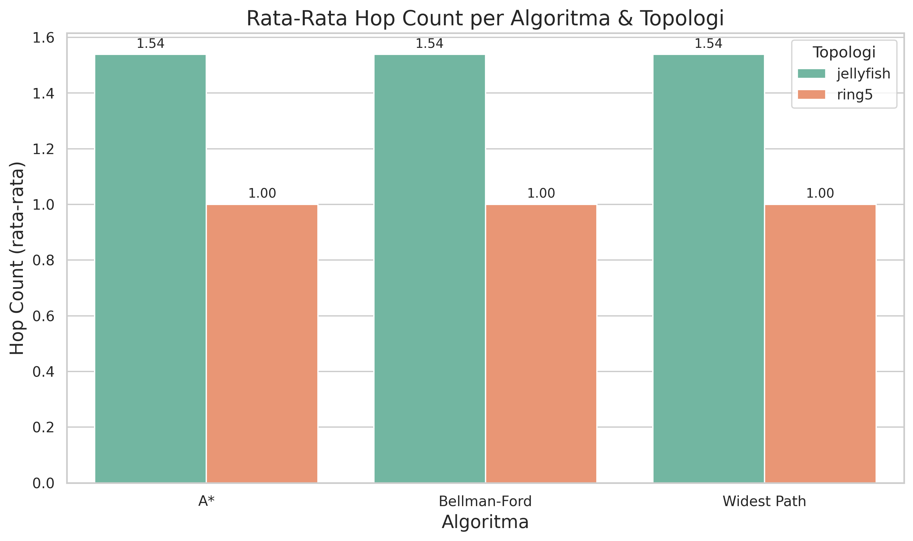

# 6. Implementasi

Bab ini menjelaskan secara runut implementasi teknis dari setiap komponen utama proyek, menampilkan cuplikan kode kritis dari pengendali OS-Ken, dan menyajikan demo hasil visualisasi performa dan resiliensi algoritma berdasarkan data final eksekusi Jupyter Notebook (`max_pairs=20`, `repetitions=5`, total **3.900 baris data**).

---

## 6.1 Pemetaan Berkas Implementasi

Berikut adalah tabel yang memetakan berkas implementasi di repositori [github.com/ValentinusMarvel/learn_sdn](https://github.com/ValentinusMarvel/learn_sdn):

| Komponen | Nama Berkas | Peran dan Fungsi |
| :--- | :--- | :--- |
| **Topologi Jaringan** | `topo-ring5_lab.py` | Membangun topologi emulasi Ring-5 (5 switch, 10 host, 2 host per switch). |
| | `jellyfish_topo.py` | Membangun topologi acak regular Jellyfish (10 switch, 10 host, seed 42). |
| **Pengendali OS-Ken (Control)** | `base_controller.py` | Menyediakan fungsi dasar SPF: deteksi topologi, pembelajaran host, instalasi flow OpenFlow 1.3, *broadcast spanning tree*, dan rerouting otomatis. |
| | `astar_osken_controller.py` | Controller subclass untuk perutean A* dengan heuristik *reverse-BFS*. |
| | `bellman_ford_osken_controller.py` | Controller subclass untuk perutean Bellman-Ford (memakai bobot dari `link_weights.json`). |
| | `widest_path_osken_controller.py` | Controller subclass untuk perutean QoS Widest Path (modifikasi Dijkstra). |
| **Algoritma Core** | `algorithms/astar.py` | Implementasi pencarian A* murni dengan heuristik reverse-BFS. |
| | `algorithms/bellman_ford.py` | Implementasi Bellman-Ford murni dengan deteksi *negative cycle*. |
| | `algorithms/widest_path.py` | Implementasi pencarian jalur dengan *bottleneck bandwidth* maksimal. |
| **Simulasi & Testbed** | `testing-code/run_live_scenarios.py` | Skrip Python otomatisasi eksekusi 7 skenario kegagalan dengan iperf3 + tcpdump. |
| **Analisis & Plot** | `analysis/plot_results.ipynb` | Jupyter Notebook pipeline analisis data: statistik, ranking, dan 8 visualisasi grafis. |
| **Konfigurasi** | `link_weights.json` | File JSON konfigurasi bobot kapasitas link statis yang dibaca oleh controller. |

---

## 6.2 Cuplikan Kode / Mekanisme Penting

### A. Mekanisme Penanganan Packet-In OpenFlow 1.3

Saat switch menerima paket yang belum memiliki aturan aliran (*flow entry*), paket tersebut diteruskan ke OS-Ken Controller melalui mekanisme *Packet-In*. Berikut adalah cuplikan kode penanganan dari `base_controller.py`:

```python
@set_ev_cls(ofp_event.EventOFPPacketIn, MAIN_DISPATCHER)
def _packet_in_handler(self, ev):
    """Handle packets not matched by any flow rule."""
    msg = ev.msg
    dp = msg.datapath
    ofproto = dp.ofproto
    parser = dp.ofproto_parser
    in_port = msg.match["in_port"]
    pkt = packet.Packet(msg.data)
    eth = pkt.get_protocol(ethernet.ethernet)

    if eth.ethertype == ether_types.ETH_TYPE_LLDP:
        return          # LLDP ditangani oleh modul topologi

    src, dst, dpid = eth.src, eth.dst, dp.id

    # Pelajari lokasi host sumber (hanya dari access port)
    if self._is_access_port(dpid, in_port):
        self._update_host_location(src, dpid, in_port)

    if dst in self.mymacs:
        # Tujuan diketahui → hitung jalur dan pasang flow
        src_sw, src_port = self.mymacs[src]
        dst_sw, dst_port = self.mymacs[dst]
        p = self.compute_path(src_sw, dst_sw, src_port, dst_port)
        if p:
            self.install_path(p, src, dst)
        else:
            # Tidak ada jalur → pasang drop flow sementara (5s)
            self._install_drop_flow(dp, in_port, src, dst, idle_timeout=5)
            return
    else:
        # Tujuan tidak diketahui → flood melalui spanning tree
        self._flood_over_tree(dp, in_port, msg.data, msg.buffer_id)
```

**Penjelasan mekanisme:**
1. Controller menerima pesan `EventOFPPacketIn` dari switch saat tidak ada flow yang cocok.
2. Paket LLDP langsung diabaikan karena ditangani oleh modul deteksi topologi.
3. Lokasi host sumber dipelajari dan disimpan dalam tabel `mymacs` (MAC → (dpid, port)).
4. Jika MAC tujuan sudah diketahui, controller memanggil `compute_path()`, yaitu fungsi abstrak yang di-*override* oleh setiap subclass algoritma (A*, Bellman-Ford, atau Widest Path).
5. Jika tidak ada jalur yang ditemukan (misalnya switch tujuan terputus), controller memasang *drop flow* sementara selama 5 detik untuk mencegah *Packet-In storm*.

### B. Mekanisme Instalasi Flow Rule (*Flow Mod*)

Setelah jalur berhasil dihitung oleh algoritma terpilih, controller memasang aturan aliran (*flow entries*) pada setiap switch di sepanjang jalur menggunakan perintah `OFPFlowMod`:

```python
def _install_unicast_flow(self, datapath, in_port, out_port, src_mac, dst_mac):
    """Install a unicast forwarding rule: delete-then-add for idempotency."""
    parser = datapath.ofproto_parser
    ofproto = datapath.ofproto
    match = parser.OFPMatch(in_port=in_port, eth_src=src_mac, eth_dst=dst_mac)
    actions = [parser.OFPActionOutput(out_port)]
    inst = [parser.OFPInstructionActions(ofproto.OFPIT_APPLY_ACTIONS, actions)]

    # Hapus flow lama (strict) terlebih dahulu untuk menjamin idempotency
    datapath.send_msg(parser.OFPFlowMod(
        datapath=datapath,
        cookie=self.FLOW_COOKIE,
        cookie_mask=FLOW_COOKIE_MASK,
        command=ofproto.OFPFC_DELETE_STRICT,
        out_port=ofproto.OFPP_ANY,
        out_group=ofproto.OFPG_ANY,
        priority=FLOW_PRIORITY,
        match=match,
    ))
    # Tambahkan flow baru
    datapath.send_msg(parser.OFPFlowMod(
        datapath=datapath,
        cookie=self.FLOW_COOKIE,
        command=ofproto.OFPFC_ADD,
        idle_timeout=0, hard_timeout=0,
        priority=FLOW_PRIORITY,
        match=match,
        instructions=inst,
    ))
```

**Penjelasan mekanisme:**
1. `OFPMatch` mendefinisikan kriteria pencocokan: port masuk, MAC sumber, dan MAC tujuan.
2. Pendekatan **delete-then-add** digunakan untuk menjamin *idempotency* (flow lama dihapus terlebih dahulu sebelum flow baru dipasang), sehingga aman dipanggil berulang kali (misalnya saat rerouting pasca-kegagalan).
3. Setiap flow ditandai dengan `FLOW_COOKIE` unik per algoritma, memungkinkan penghapusan selektif saat topologi berubah.
4. Flow dipasang **bidirectional** (baik arah maju (src→dst) maupun arah balik (dst→src)) untuk memastikan komunikasi TCP dua arah dapat berjalan lancar.

### C. Mekanisme Rerouting Otomatis Saat Topologi Berubah

Saat terjadi kegagalan link atau switch, OS-Ken mendeteksi perubahan topologi melalui pesan LLDP dan memanggil handler berikut:

```python
@set_ev_cls(TOPOLOGY_EVENTS)
def get_topology_data(self, ev):
    """Handle topology change events from OSKen's LLDP-based discovery."""
    # ... (parse switch_list dan links_list) ...

    if old_sig != new_sig:
        # Topologi berubah → flush semua flow lama
        self._purge_hosts_on_departed_switches()
        self._flush_all_flows()

        # Bangun ulang spanning tree dan reinstall semua rute
        self._build_broadcast_tree()
        self._on_topology_changed()        # hook untuk subclass (e.g., precompute)
        self._reinstall_all_known_routes()  # kalkulasi ulang jalur untuk semua pasangan host
```

Mekanisme ini memastikan bahwa saat terjadi kegagalan, controller secara proaktif menghitung ulang seluruh jalur yang diketahui menggunakan algoritma routing aktif, tanpa menunggu Packet-In baru dari switch.

---

## 6.3 Hasil Pengujian & Demo Visualisasi

Seluruh visualisasi di bawah ini dihasilkan secara otomatis oleh Jupyter Notebook (`plot_results_executed_final.ipynb`) yang dieksekusi pada lingkungan VM dengan parameter `max_pairs=20` dan `repetitions=5`.

### A. Perbandingan Throughput Rata-Rata per Skenario



**Interpretasi:**
*   Pada kondisi **baseline** (tanpa gangguan), ketiga algoritma menunjukkan performa throughput yang hampir identik di kedua topologi: **~95.14–95.28 Mbps** pada Jellyfish dan **~94.90–95.28 Mbps** pada Ring-5, mendekati batas kapasitas link 100 Mbps pada emulasi Mininet.
*   **Anomali kritis pada skenario Bandwidth Throttle di Ring-5**: A* dan Widest Path mengalami degradasi throughput yang sangat tajam; A* turun ke **56.70 Mbps** (penurunan **–40.49%** dari baseline) dan Widest Path turun drastis ke **48.12 Mbps** (penurunan **–49.49%**). Sebaliknya, Bellman-Ford tetap stabil di **94.95 Mbps** (penurunan hanya **+0.05%**).
*   **Akar penyebab**: Controller Bellman-Ford memperlakukan bandwidth statis dari `link_weights.json` sebagai **biaya/cost jalur** (semakin tinggi bandwidth, semakin tinggi cost), sehingga secara tidak sengaja *menghindari* link `s1-s2` yang memiliki cost tertinggi (1000), yaitu link yang justru sedang di-throttle oleh Mininet. Ini adalah perilaku *bypass throttling* yang tidak disengaja.
*   **Pada topologi Jellyfish**, dampak bandwidth throttle lebih kecil karena topologi acak menyediakan lebih banyak jalur alternatif. Widest Path turun ke **82.37 Mbps** (–13.54%), sedangkan A* dan Bellman-Ford tetap di ~95 Mbps.

---

### B. Distribusi Waktu Komputasi Jalur (Runtime)



**Interpretasi:**
*   **A\*** memiliki runtime komputasi jalur tercepat secara konsisten pada topologi kompleks, dengan rata-rata keseluruhan **0.0749 ms** pada Jellyfish dan **0.0526 ms** pada Ring-5. Penggunaan heuristik *reverse-BFS hop-count* secara efektif membatasi jumlah node graf yang perlu diperiksa (*pruning*).
*   **Bellman-Ford** menunjukkan runtime yang sangat kompetitif di Ring-5 (rata-rata **0.0517 ms**) karena topologi ring yang kecil (5 switch) membatasi jumlah iterasi relaksasi. Pada Jellyfish, runtime sedikit lebih tinggi (rata-rata **0.0942 ms**) karena 10 switch memerlukan lebih banyak iterasi.
*   **Widest Path** secara umum lebih lambat dibanding A* karena menggunakan modifikasi Dijkstra tanpa heuristik (rata-rata **0.0846 ms** pada Jellyfish dan **0.0909 ms** pada Ring-5). Pada skenario `link_down_during_traffic` di Ring-5, terjadi *outlier* runtime hingga **0.2700 ms**, menunjukkan beberapa kalkulasi jalur yang lambat saat topologi berubah di tengah transfer data.
*   Secara keseluruhan, semua algoritma beroperasi di bawah **1 ms**, menunjukkan bahwa overhead komputasi jalur tidak menjadi bottleneck signifikan pada skala topologi yang diuji.

---

### C. Analisis Resiliensi: Dampak Kegagalan (*Failure Recovery*)



**Interpretasi:**

#### Topologi Jellyfish (Throughput Delta dari Baseline)
| Algoritma | Fase *During* | Fase *Pre* |
| :--- | :---: | :---: |
| **A\*** | **–6.73%** (88.74 Mbps) | +0.10% (95.24 Mbps) |
| **Bellman-Ford** | **–5.10%** (90.37 Mbps) | –0.05% (95.17 Mbps) |
| **Widest Path** | **–6.24%** (89.33 Mbps) | **–3.94%** (91.52 Mbps) |

*   Skenario *during* (link_down_during_traffic + link_flap) menyebabkan penurunan throughput **5–7%** pada ketiga algoritma di Jellyfish. Bellman-Ford menunjukkan resiliensi terbaik dengan penurunan hanya 5.10%.
*   Widest Path mengalami penurunan tambahan **–3.94%** pada fase *pre* karena skenario bandwidth_throttle yang menyebabkan ia memilih jalur throttled.

#### Topologi Ring-5 (Throughput Delta dari Baseline)
| Algoritma | Fase *During* | Fase *Pre* |
| :--- | :---: | :---: |
| **A\*** | –0.37% (94.92 Mbps) | **–16.59%** (79.47 Mbps) |
| **Bellman-Ford** | **+0.14%** (95.03 Mbps) | +0.19% (95.08 Mbps) |
| **Widest Path** | –0.61% (94.69 Mbps) | **–20.23%** (75.99 Mbps) |

*   Pada Ring-5, Bellman-Ford menunjukkan **resiliensi luar biasa** di mana throughput bahkan sedikit *meningkat* (+0.14%) pada fase *during*. Ini disebabkan oleh perilaku bypass throttling yang sama yang telah dijelaskan sebelumnya.
*   A* dan Widest Path mengalami penurunan sangat besar pada fase *pre* (masing-masing **–16.59%** dan **–20.23%**) karena skenario bandwidth_throttle yang secara efektif mengurangi kapasitas link utama s1-s2 dari 1000 Mbps ke 10 Mbps.

---

### D. Analisis Retransmisi TCP



**Interpretasi:**
*   Skenario **link_flap** menghasilkan retransmisi TCP tertinggi pada kedua topologi: A* sebanyak **17.283** pada Jellyfish dan Widest Path sebanyak **16.231** pada Jellyfish, serta **13.271** pada Ring-5.
*   Bellman-Ford secara konsisten memiliki retransmisi lebih rendah di Ring-5 (**1.424** pada link_flap vs **3.962** pada A*), menunjukkan bahwa jalur yang dipilihnya lebih stabil terhadap fluktuasi link.
*   Skenario **switch_down** menariknya hanya menghasilkan **0–4 retransmisi** karena koneksi langsung terputus secara total (host kehilangan akses ke switch fisiknya), sehingga iperf3 gagal sepenuhnya tanpa sempat melakukan retransmisi.

---

### E. Hop Count Comparison



**Interpretasi:**
*   **A\*** dan **Bellman-Ford** menghasilkan rata-rata hop count yang identik: **1.750** pada Jellyfish dan **1.450** pada Ring-5, menunjukkan bahwa keduanya menemukan jalur terpendek yang sama.
*   **Widest Path** secara konsisten menghasilkan hop count lebih tinggi: **2.250** pada Jellyfish dan **1.650** pada Ring-5. Ini karena algoritma ini mengoptimalkan *bottleneck bandwidth* bukan jarak, sehingga memilih jalur yang lebih panjang tetapi memiliki kapasitas link minimal yang lebih besar.
*   Perbedaan hop count ini menjelaskan mengapa Widest Path memiliki runtime yang sedikit lebih tinggi, karena ia memasang lebih banyak flow entries per jalur.

---

## 6.4 Hasil Peringkat Komposit Akhir

Berikut adalah tabel peringkat akhir performa algoritma komposit per topologi hasil olahan Jupyter Notebook. Skor komposit dihitung menggunakan normalisasi Min-Max pada metrik: throughput (rata-rata), runtime, dan success rate, kemudian diagregasi dengan bobot seimbang. Skala skor: 0.0 (terburuk) hingga 1.0 (terbaik).

### A. Topologi Jellyfish (10 Switch, 10 Host, 7 Skenario)

| Peringkat | Algoritma | Mean Throughput (Mbps) | Mean Runtime (ms) | Success Rate | Composite Score |
| :---: | :---: | :---: | :---: | :---: | :---: |
| 🥇 1 | **Bellman-Ford** | 93.79 | 0.0942 | 89.43% | **0.8000** |
| 🥈 2 | **A\*** | 93.35 | 0.0749 | 89.29% | **0.7046** |
| 🥉 3 | **Widest Path** | 91.49 | 0.0846 | 89.29% | **0.0991** |

### B. Topologi Ring-5 (5 Switch, 10 Host, 6 Skenario)

| Peringkat | Algoritma | Mean Throughput (Mbps) | Mean Runtime (ms) | Success Rate | Composite Score |
| :---: | :---: | :---: | :---: | :---: | :---: |
| 🥇 1 | **Bellman-Ford** | 95.03 | 0.0517 | 90.83% | **0.8000** |
| 🥈 2 | **A\*** | 88.04 | 0.0526 | 90.83% | **0.2897** |
| 🥉 3 | **Widest Path** | 86.39 | 0.0909 | 90.83% | **0.0000** |

### C. Analisis Anomali dan Catatan Penting

> **Catatan Kritis Mengenai Kemenangan Bellman-Ford:**
> Bellman-Ford menempati peringkat #1 di kedua topologi bukan karena algoritmanya secara intrinsik superior, melainkan karena **perilaku bypass throttling yang tidak disengaja**. Controller Bellman-Ford membaca kapasitas bandwidth dari `link_weights.json` dan memperlakukannya sebagai *biaya jalur* (cost). Akibatnya, link dengan bandwidth tertinggi (1000 Mbps pada `s1-s2`) dianggap sebagai link dengan cost tertinggi, sehingga Bellman-Ford secara tidak sengaja menghindari link tersebut, yaitu link yang justru sedang dibatasi kapasitasnya oleh skenario bandwidth throttle.

> **Implikasi untuk Desain Perutean:**
> Temuan ini menunjukkan bahwa **pemilihan representasi bobot link** pada algoritma perutean memiliki dampak yang sangat signifikan terhadap performa. Jika bandwidth digunakan sebagai cost (bukan kapasitas), maka algoritma yang "salah" justru bisa tampil lebih baik dalam kondisi tertentu. Hal ini menjadi rekomendasi penting untuk desain controller SDN di lingkungan produksi.
