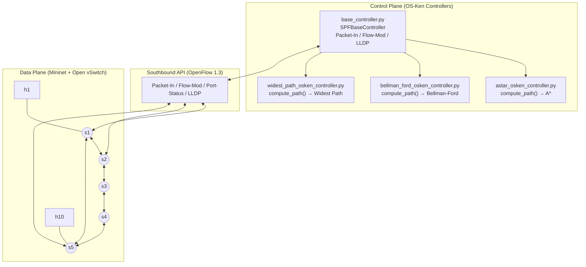

# BAB IV IMPLEMENTASI

## 4.1 Integrasi dengan Repositori

Implementasi perutean SPF terintegrasi penuh dengan struktur modular repositori `learn_sdn` di GitHub ([github.com/ValentinusMarvel/learn_sdn](https://github.com/ValentinusMarvel/learn_sdn)). Desain arsitektur mengikuti pola *template method*, di mana kelas induk menangani seluruh logika OpenFlow dan kelas anak hanya perlu mengimplementasikan fungsi `compute_path()`.

**Tabel Pemetaan Berkas Implementasi:**

| Komponen | Nama Berkas | Peran dan Fungsi |
| :--- | :--- | :--- |
| **Topologi** | `topo-ring5_lab.py` | Membangun topologi Ring-5 (5 switch, 10 host, 2 host per switch, 100 Mbps, 2 ms delay). |
| | `jellyfish_topo.py` | Membangun topologi acak regular Jellyfish (10 switch, 10 host, seed 42). |
| **Pengendali Induk** | `base_controller.py` | Kerangka dasar: deteksi topologi LLDP, pembelajaran host MAC, instalasi flow OpenFlow 1.3, pembangunan spanning tree BFS, rerouting otomatis. |
| **Pengendali Algoritme** | `astar_osken_controller.py` | Subclass A\* dengan heuristik *reverse-BFS*. |
| | `bellman_ford_osken_controller.py` | Subclass Bellman-Ford menggunakan bobot dari `link_weights.json`. |
| | `widest_path_osken_controller.py` | Subclass Widest Path (modifikasi Dijkstra dengan *max-heap*). |
| **Algoritme Murni** | `algorithms/astar.py` | Implementasi pencarian A\* terpisah dari dependensi OS-Ken. |
| | `algorithms/bellman_ford.py` | Implementasi Bellman-Ford murni dengan deteksi *negative cycle*. |
| | `algorithms/widest_path.py` | Implementasi pencarian jalur dengan *bottleneck bandwidth* maksimal. |
| **Testbed** | `testing-code/run_live_scenarios.py` | Skrip utama pengeksekusi otomatisasi 7 skenario kegagalan. |
| | `benchmark_core.py` | Pustaka inti orkestrasi emulasi (Mininet, OS-Ken, dan iperf3). |
| | `benchmark_jsonl_to_csv.py` | Konversi log JSONL ke tabel CSV terstruktur. |
| **Konfigurasi** | `link_weights.json` | File JSON bobot kapasitas tautan statis yang dibaca oleh controller Bellman-Ford dan Widest Path. |
| **Analisis** | `analysis/plot_results_executed_final.ipynb` | Jupyter Notebook pipeline analisis data: statistik, peringkat komposit, dan 8 visualisasi grafis. |

Diagram arsitektur sistem yang menggambarkan pemisahan *control plane* dan *data plane* adalah sebagai berikut:



---

## 4.2 Modifikasi yang Dilakukan

Tiga mekanisme kritis diimplementasikan di dalam `base_controller.py` untuk mendukung tujuan proyek:

**A. Penanganan Paket Baru (*Packet-In Handler*)**

Saat switch menerima paket yang belum memiliki aturan aliran, paket tersebut diteruskan ke OS-Ken melalui mekanisme *Packet-In*. Handler berikut menangani pembelajaran MAC host dan pemanggilan fungsi `compute_path()`:

```python
# Berkas: base_controller.py (Fungsi _packet_in_handler)
@set_ev_cls(ofp_event.EventOFPPacketIn, MAIN_DISPATCHER)
def _packet_in_handler(self, ev):
    msg = ev.msg
    dp = msg.datapath
    in_port = msg.match["in_port"]
    pkt = packet.Packet(msg.data)
    eth = pkt.get_protocol(ethernet.ethernet)
    if eth.ethertype == ether_types.ETH_TYPE_LLDP:
        return  # Paket LLDP ditangani modul topologi
    src, dst = eth.src, eth.dst
    # Pelajari lokasi host sumber dari port akses
    if self._is_access_port(dp.id, in_port):
        self._update_host_location(src, dp.id, in_port)
    if dst in self.mymacs:
        # Tujuan diketahui: hitung jalur dan pasang flow
        src_sw, src_port = self.mymacs[src]
        dst_sw, dst_port = self.mymacs[dst]
        p = self.compute_path(src_sw, dst_sw, src_port, dst_port)
        if p:
            self.install_path(p, src, dst)
        else:
            # Tidak ada jalur: pasang drop flow sementara (5 detik)
            self._install_drop_flow(dp, in_port, src, dst, idle_timeout=5)
    else:
        # Tujuan tidak diketahui: flood melalui spanning tree BFS
        self._flood_over_tree(dp, in_port, msg.data, msg.buffer_id)
```

**B. Instalasi Aturan Aliran Bidirectional (*Flow Mod*)**

Setelah jalur dihitung, aturan aliran dipasang secara dua arah di setiap switch sepanjang jalur menggunakan pendekatan *delete-then-add* untuk menjamin *idempotency* saat rerouting:

```python
# Berkas: base_controller.py (Fungsi _install_unicast_flow)
def _install_unicast_flow(self, datapath, in_port, out_port, src_mac, dst_mac):
    parser = datapath.ofproto_parser
    ofproto = datapath.ofproto
    match = parser.OFPMatch(in_port=in_port, eth_src=src_mac, eth_dst=dst_mac)
    actions = [parser.OFPActionOutput(out_port)]
    inst = [parser.OFPInstructionActions(ofproto.OFPIT_APPLY_ACTIONS, actions)]
    # Hapus flow lama terlebih dahulu (strict) untuk menjamin idempotency
    datapath.send_msg(parser.OFPFlowMod(
        datapath=datapath, cookie=self.FLOW_COOKIE,
        cookie_mask=FLOW_COOKIE_MASK,
        command=ofproto.OFPFC_DELETE_STRICT,
        out_port=ofproto.OFPP_ANY, out_group=ofproto.OFPG_ANY,
        priority=FLOW_PRIORITY, match=match,
    ))
    # Pasang flow baru
    datapath.send_msg(parser.OFPFlowMod(
        datapath=datapath, cookie=self.FLOW_COOKIE,
        command=ofproto.OFPFC_ADD,
        idle_timeout=0, hard_timeout=0,
        priority=FLOW_PRIORITY, match=match, instructions=inst,
    ))
```

Pendekatan *delete-then-add* memastikan bahwa setiap kali terjadi rerouting, flow rule yang sudah tidak relevan dihapus sebelum flow baru dipasang, sehingga tidak terjadi konflik antara rute lama dan rute baru di tabel flow switch.

---

## 4.3 Kendala Selama Implementasi

Selama proses implementasi dan pengujian, tiga kendala teknis signifikan ditemui dan ditangani:

**Kendala 1: Inkonsistensi Data Tautan Statis vs Dinamis**

Controller Bellman-Ford dan Widest Path membaca bobot tautan dari file statis `link_weights.json`. Ketika Mininet membatasi bandwidth fisik tautan `s1-s2` secara dinamis pada skenario *bandwidth throttle*, kedua controller tidak mengetahui perubahan tersebut karena tidak ada mekanisme pemantauan statistik port secara real-time. Hal ini mengakibatkan keputusan routing yang tidak optimal dan munculnya anomali *bypass throttling* pada Bellman-Ford. Kendala ini ditangani secara analitik dalam laporan: anomali dijadikan temuan ilmiah yang penting, dan usulan implementasi `OFPPortStatsRequest` dimasukkan sebagai rekomendasi pengembangan.

**Kendala 2: Latensi Akumulasi *Packet-In* pada `max_pairs=20`**

Pada eksekusi dengan `max_pairs=20`, inisialisasi awal memicu gelombang *Packet-In* saat 20 pasangan host mulai saling mengirim paket ARP secara bersamaan. Hal ini menciptakan antrean kalkulasi rute di controller yang meningkatkan latensi runtime secara kumulatif. Kendala ini diatasi dengan memasang batas waktu *drop flow* selama 5 detik untuk host yang belum memiliki rute, sehingga mencegah pengiriman ulang ARP berulang yang memperburuk beban controller.

**Kendala 3: Isolasi Host pada Skenario *Switch Down***

Skenario `switch_down` pada kedua topologi langsung memutus koneksi fisik host akses ke jaringan secara total, menghasilkan error iperf3 "JSON payload did not include bits_per_second". Hal ini bukan kegagalan algoritme routing, melainkan akibat dari ketiadaan jalur fisik alternatif menuju host yang terisolasi. Kendala ini diatasi dengan memodifikasi pipeline Jupyter Notebook analisis data untuk memisahkan baris status `error` ke dataset `df_errors` tersendiri, sehingga nilai throughput rata-rata algoritme pada data sukses (`df_ok`) tidak terdistorsi oleh nilai nol dari host yang terisolasi.
