# 4.1 Halaman Judul

## LAPORAN PROYEK AKHIR KULIAH
### MATA KULIAH: ARSITEKTUR JARINGAN MODERN

---

### JUDUL PROYEK:
**Analisis Komparatif Performa dan Resiliensi Algoritma Routing *Single-Source Shortest Path* (A\*, Bellman-Ford, dan Widest Path) pada Jaringan *Software-Defined Networking* (SDN) Berbasis OS-Ken dan Mininet**

*   **Topik yang Dipilih**: Topik 1 (Analisis Performa Algoritma Perutean SPF Tunggal)
*   **Nama Mata Kuliah**: Arsitektur Jaringan Modern
*   **Semester Akademik**: Semester Genap / 2025-2026
*   **Dosen Pengampu**: [Nama Dosen Pengampu]
*   **Program Studi**: Teknik Informatika / Teknik Komputer

### DAFTAR ANGGOTA KELOMPOK:
| No | Nama | NIM |
|:-:|:---|:---:|
| 1 | [Nama Anggota 1] | [NIM Anggota 1] |
| 2 | [Nama Anggota 2] | [NIM Anggota 2] |
| 3 | [Nama Anggota 3] | [NIM Anggota 3] |
| 4 | [Nama Anggota 4] | [NIM Anggota 4] |

---

# 4.2 Abstrak

Penelitian ini bertujuan untuk melakukan analisis komparatif terhadap performa dan resiliensi tiga algoritme perutean *Single-Source Shortest Path* (SPF), yaitu A\*, Bellman-Ford, dan Widest Path, pada jaringan *Software-Defined Networking* (SDN). Pengujian dilakukan menggunakan emulator Mininet dengan pengendali berbasis OS-Ken melalui protokol OpenFlow 1.3 pada dua arsitektur jaringan yang berbeda: topologi teratur melingkar (Ring-5) dan topologi acak regular (Jellyfish). Eksperimen dijalankan di bawah tujuh skenario kegagalan dinamis yang mencakup kondisi *baseline* tanpa gangguan, pemutusan link sebelum dan selama transmisi data, fluktuasi tautan (*link flap*), kegagalan switch total (*switch down*), pembatasan bandwidth (*bandwidth throttle*), dan pemutusan link acak khusus Jellyfish. Data dikumpulkan secara otomatis melalui testbed terotomatisasi dengan parameter 20 pasangan host acak dan 5 kali pengulangan untuk setiap skenario, menghasilkan total 3.900 baris data pengujian yang valid. Hasil evaluasi menunjukkan dua temuan utama. Pertama, algoritme A\* secara konsisten mencatatkan runtime komputasi jalur tercepat pada topologi kompleks Jellyfish, yaitu rata-rata 0.0749 ms, dibandingkan Bellman-Ford (0.0942 ms) dan Widest Path (0.0846 ms); keunggulan ini berasal dari mekanisme pemangkasan (*pruning*) berbasis estimasi heuristik *reverse-BFS* yang membatasi eksplorasi node graf tidak relevan. Kedua, algoritme Bellman-Ford menempati peringkat komposit teratas di kedua topologi dengan skor komposit 0.8000 karena mengalami anomali *bypass throttling* yang menguntungkan: controller Bellman-Ford membaca matriks bandwidth statis dari file konfigurasi `link_weights.json` sebagai *biaya jalur* (bukan kapasitas), sehingga secara tidak sengaja menghindari link yang sedang dibatasi kapasitasnya dan berhasil mempertahankan throughput 95.03 Mbps pada Ring-5. Sebaliknya, Widest Path mencatatkan penurunan throughput paling drastis hingga 86.39 Mbps pada Ring-5 akibat ketidakmampuan controller beradaptasi terhadap pembatasan bandwidth dinamis yang tidak tercatat di konfigurasi statis. Temuan ini menegaskan pentingnya representasi bobot link yang dinamis pada pengendali SDN untuk menjamin efisiensi dan keakuratan perutean di berbagai kondisi kegagalan jaringan.

**Kata Kunci**: *Software-Defined Networking*, OpenFlow, A\*, Bellman-Ford, Widest Path, Mininet, OS-Ken.
# 4.3 Pendahuluan

## 4.3.1 Latar Belakang

Perkembangan teknologi jaringan komputer menuntut tingkat efisiensi, skalabilitas, dan keandalan yang semakin tinggi. Pada arsitektur jaringan tradisional, keputusan perutean dilakukan secara terdistribusi di setiap router menggunakan protokol statis atau dinamis konvensional seperti OSPF (*Open Shortest Path First*) dan RIP (*Routing Information Protocol*). Pendekatan terdistribusi ini membatasi visibilitas jaringan secara global, memperlambat proses konvergensi saat terjadi kegagalan tautan (*link failure*), dan mempersulit rekayasa lalu lintas (*traffic engineering*) yang membutuhkan pengendalian rute secara terpusat [1].

*Software-Defined Networking* (SDN) hadir sebagai paradigma baru dengan memisahkan bidang kontrol (*control plane*) dan bidang data (*data plane*) secara tegas. Melalui pengendali terpusat (*SDN controller*), administrator memiliki visibilitas global atas seluruh topologi jaringan dan dapat menginstruksikan switch bidang data untuk memasang aturan aliran (*flow rules*) secara dinamis melalui protokol standar OpenFlow [1]. Fleksibilitas ini membuka peluang untuk mengimplementasikan berbagai algoritme perutean *Shortest Path First* (SPF) secara terprogram langsung dari pengendali, sesuatu yang tidak mungkin dilakukan pada jaringan tradisional tanpa mengganti firmware perangkat keras.

Namun, efektivitas komputasi jalur terpendek sangat dipengaruhi oleh dua faktor: karakteristik algoritme routing yang digunakan dan bentuk fisik topologi jaringan tempat algoritme tersebut dijalankan. Terdapat perbedaan mendasar dalam cara ketiga algoritme utama mencari rute: algoritme A\* memanfaatkan estimasi heuristik jarak untuk memangkas pencarian secara terarah [5]; Bellman-Ford melakukan relaksasi iteratif yang mampu menangani cost link heterogen [6]; sedangkan Widest Path berfokus pada maksimalisasi kapasitas minimum di sepanjang jalur (*bottleneck bandwidth*) [7]. Performa dan resiliensi ketiga algoritme ini perlu diuji secara empiris pada topologi yang berbeda. Topologi Ring-5 mewakili arsitektur teratur dengan redundansi jalur terbatas, sementara topologi Jellyfish mewakili arsitektur jaringan pusat data modern (*data center network*) yang memiliki redundansi tinggi dan jalur alternatif yang melimpah [2].

Komparasi kuantitatif ini penting untuk memberikan panduan empiris bagi insinyur jaringan dalam memilih algoritme perutean yang paling sesuai dengan karakteristik topologi dan kebutuhan *Quality of Service* (QoS) di lingkungan SDN produksi.

---

## 4.3.2 Tujuan Proyek

Tujuan utama yang ingin dicapai dari proyek akhir ini adalah:

1.  **Mengimplementasikan Pengendali SDN SPF Modular**: Mengembangkan aplikasi pengendali berbasis OS-Ken yang mampu menghitung jalur secara dinamis menggunakan tiga algoritme perutean (A\*, Bellman-Ford, dan Widest Path) dengan arsitektur satu kelas induk (`base_controller.py`) dan tiga subclass algoritmik yang dapat dipertukarkan.
2.  **Membangun Testbed Pengujian Otomatis**: Menyusun skrip simulasi Mininet terotomatisasi yang dapat menguji ketahanan (*resilience*) jaringan di bawah 7 skenario kegagalan, mencakup pemutusan link, fluktuasi tautan, pembatasan bandwidth, dan kegagalan switch total, dengan parameter `max_pairs=20` dan `repetitions=5`.
3.  **Melakukan Evaluasi Kuantitatif dan Peringkat Komposit**: Menganalisis metrik-metrik performa utama (throughput, runtime, packet loss, TCP retransmits, hop count, dan recovery delta) berdasarkan 3.900 baris data eksperimen empiris untuk memberikan peringkat komposit performa algoritme pada masing-masing topologi.

---

## 4.3.3 Ruang Lingkup

Eksperimen dalam proyek akhir ini dibatasi oleh ruang lingkup dan batasan sebagai berikut:

1.  **Infrastruktur Emulasi**: Menggunakan emulator Mininet v2.3+ untuk mereplikasi *data plane* dengan switch berbasis Open vSwitch (OVS) dan protokol komunikasi OpenFlow 1.3 [2].
2.  **Kerangka Pengendali**: Bidang kontrol dikelola menggunakan kerangka kerja pengendali OS-Ken (Python 3), yaitu fork aktif dan terawat dari controller Ryu yang tidak lagi dikembangkan [3].
3.  **Topologi Jaringan**: Evaluasi dibatasi pada dua jenis topologi, yaitu Ring-5 (5 switch melingkar, 10 host, 2 host per switch) dan Jellyfish (10 switch acak regular dengan seed 42, 10 host).
4.  **Algoritme Routing**: Algoritme yang dievaluasi mencakup A\*, Bellman-Ford, dan Widest Path sebagai algoritme perutean utama, serta BFS untuk pembangunan *broadcast spanning tree*.
5.  **Metrik Evaluasi**: Data yang dianalisis mencakup throughput TCP (iperf3 [4]), runtime pencarian jalur (milidetik), packet loss (pingall), retransmisi TCP, hop count rute terpilih, dan recovery throughput delta.
6.  **Batasan Proyek**: Pembaruan kapasitas link aktual oleh controller bersifat statis dan dibaca dari file konfigurasi `link_weights.json` secara *offline*, tanpa mekanisme permintaan statistik port (`OFPPortStatsRequest`) secara berkala. Evaluasi juga dibatasi pada lalu lintas data iperf3 TCP tunggal antar satu pasangan host aktif pada satu waktu (*single-flow*), tanpa *background traffic*.

---

## 4.3.4 Sistematika Laporan

Laporan proyek akhir ini disusun dengan sistematika sebagai berikut:

*   **Bab 4.1 dan 4.2 (Halaman Judul dan Abstrak)**: Memuat identitas proyek, daftar anggota kelompok, dosen pengampu, serta ringkasan eksekutif penelitian yang mencakup topik, metode, dan dua temuan utama.
*   **Bab 4.3 (Pendahuluan)**: Menjelaskan latar belakang permasalahan perutean dinamis pada SDN, tiga tujuan proyek yang terukur, ruang lingkup pengujian beserta batasannya, serta sistematika laporan ini.
*   **Bab 4.4 (Landasan Teori)**: Memaparkan dasar ilmiah mengenai mekanisme OpenFlow, teori dasar dan kompleksitas algoritme A\*, Bellman-Ford, dan Widest Path, karakteristik topologi Ring-5 dan Jellyfish, serta definisi metrik QoS yang digunakan.
*   **Bab 4.5 (Metodologi)**: Merinci alur perancangan eksperimen dengan 7 skenario kegagalan, konfigurasi parameter link topologi, cuplikan kode inisialisasi topologi aktual, serta prosedur terperinci pengumpulan data yang memungkinkan replikasi penelitian.
*   **Bab 4.6 (Implementasi)**: Memaparkan struktur modular repositori `learn_sdn`, tabel pemetaan berkas implementasi, cuplikan kode kritis mekanisme *Packet-In* dan *Flow-Mod*, serta diagram arsitektur sistem, dan kendala teknis yang dihadapi beserta solusinya.
*   **Bab 4.7 (Hasil dan Analisis)**: Menyajikan delapan grafik hasil ekspor Jupyter Notebook dengan interpretasi analitik per gambar, tabel pivot ringkasan metrik per skenario, analisis perbandingan algoritme, dan pembahasan tiga anomali utama yang ditemukan.
*   **Bab 4.8 (Kesimpulan dan Saran)**: Merangkum pencapaian tiga tujuan proyek berdasarkan bukti kuantitatif, mengidentifikasi keterbatasan sistem, dan memberikan rekomendasi pengembangan modul QoS dinamis serta perutean multipath.
*   **Bab 4.9 dan 4.10 (Daftar Pustaka dan Lampiran)**: Menyajikan delapan daftar literatur referensi dalam format IEEE dan lampiran yang memuat enam tabel data ringkasan performa, deskripsi repositori kode, serta matriks kontribusi anggota kelompok.
# 4.4 Landasan Teori

## 4.4.1 Algoritme yang Diuji

Komputasi rute dinamis pada graf topologi jaringan memanfaatkan beberapa algoritme pencarian jalur terpendek yang disesuaikan dengan kebutuhan optimasi masing-masing. Proyek ini mengimplementasikan empat algoritme berikut:

**1. Breadth-First Search (BFS)**

BFS melakukan penelusuran graf tingkat demi tingkat (*layer-by-layer*) mulai dari node akar, mengeksplorasi semua node tetangga pada kedalaman saat ini sebelum berpindah ke kedalaman berikutnya. Dalam konteks proyek ini, BFS tidak digunakan sebagai algoritme perutean utama, melainkan untuk dua fungsi kritis: membangun *broadcast spanning tree* guna mencegah *looping* paket ARP di *data plane*, serta menghitung estimasi jarak hop minimum (*heuristic*) yang digunakan oleh algoritme A\*. Kompleksitas waktu BFS adalah $O(V + E)$, di mana $V$ adalah jumlah switch dan $E$ adalah jumlah tautan fisik.

**2. Algoritme A\***

A\* adalah algoritme pencarian terarah (*informed search*) yang memperkirakan total biaya rute terkecil melalui setiap node $n$ menggunakan fungsi evaluasi $f(n) = g(n) + h(n)$ [5]. Variabel $g(n)$ merepresentasikan biaya aktual dari node sumber ke node $n$, sedangkan $h(n)$ adalah estimasi heuristik biaya tersisa dari node $n$ ke tujuan. Dalam implementasi proyek ini, fungsi heuristik $h(n)$ dihitung menggunakan jarak hop minimum dari tujuan ke setiap node via *reverse-BFS*, yang memastikan heuristik bersifat *admissible* (tidak pernah melebih-lebihkan biaya sebenarnya). Kompleksitas waktu A\* pada kasus rata-rata adalah $O(E \log V)$ menggunakan *priority queue*. Karakteristik utama A\* adalah efisiensinya karena mampu memangkas (*pruning*) eksplorasi node yang tidak mengarah ke tujuan, menjadikannya sangat unggul pada topologi dengan banyak node seperti Jellyfish.

**3. Algoritme Bellman-Ford**

Bellman-Ford menemukan jalur terpendek dari satu node sumber ke semua node lainnya melalui relaksasi bobot tautan secara iteratif sebanyak $V-1$ kali [6]. Pada setiap iterasi, algoritme memperbarui estimasi jarak terpendek ke setiap node jika ditemukan jalur alternatif yang lebih murah. Kompleksitas waktu Bellman-Ford adalah $O(V \times E)$, yang secara teoritis lebih lambat dari A\* pada graf besar. Namun, Bellman-Ford memiliki kelebihan menangani bobot tautan negatif dan kemampuan mendeteksi siklus berbobot negatif (*negative cycle*). Dalam implementasi proyek, pengendali Bellman-Ford membaca bobot tautan dari file konfigurasi `link_weights.json` dan menggunakannya secara langsung sebagai *biaya jalur* (cost), yang menciptakan perilaku unik yang dibahas lebih lanjut pada bab analisis.

**4. Algoritme Widest Path (*Bottleneck Routing*)**

Widest Path adalah modifikasi dari algoritme Dijkstra yang tujuannya bukan meminimalkan jarak, melainkan mencari jalur yang memaksimalkan *minimum bandwidth* (kapasitas terendah) di sepanjang rute [7]. Algoritme ini menggunakan *max-heap* sebagai antrean prioritas untuk selalu memilih node tetangga dengan *bottleneck bandwidth* terbesar. Kompleksitas waktu Widest Path adalah $O(E \log V)$, setara dengan A\*. Karakteristik utamanya adalah memprioritaskan kapasitas lalu lintas (*widest*) bukan jarak lompatan (*shortest*), yang secara langsung berpengaruh pada hop count yang lebih tinggi dibanding A\* dan Bellman-Ford.

---

## 4.4.2 Topologi Jaringan

Struktur fisik *data plane* SDN memiliki pengaruh signifikan terhadap performa perutean dan tingkat resiliensi jalur terhadap kegagalan tautan. Proyek ini membandingkan dua karakteristik topologi yang bertolak belakang untuk mengevaluasi adaptabilitas algoritme pada kondisi jaringan yang berbeda:

**1. Topologi Ring-5 (Melingkar Teratur)**

Topologi Ring-5 terdiri dari 5 switch yang saling terhubung membentuk lingkaran tertutup dengan pola hubungan s1-s2-s3-s4-s5-s1. Setiap switch terhubung langsung dengan 2 host akses, sehingga total terdapat 10 host dalam jaringan. Semua tautan inter-switch dikonfigurasi dengan bandwidth 100 Mbps dan delay 2 ms, memberikan dasar performa yang seragam. Topologi ini memiliki *node degree* inter-switch yang rendah dan konstan (degree 2), yang berarti setiap switch hanya memiliki tepat 2 jalur inter-switch untuk mencapai switch tetangganya.

Topologi Ring-5 dipilih karena mewakili arsitektur jaringan teratur dengan tingkat redundansi jalur yang sangat minim. Apabila satu tautan inter-switch putus, hanya tersisa tepat satu jalur memutar yang panjang untuk menghubungkan kedua ujung. Karakteristik ini menjadikannya sangat ideal untuk menguji batas ketahanan algoritme SPF pada skenario *single link failure*, di mana kemampuan rerouting dengan *hop count* seefisien mungkin sangat diuji.

**2. Topologi Jellyfish (Acak Regular)**

Topologi Jellyfish adalah arsitektur jaringan pusat data (*data center network*) berbasis graf acak $d$-regular. Setiap switch dihubungkan secara acak namun dengan *node degree* inter-switch yang seragam, menghasilkan jaringan dengan distribusi jalur yang lebih merata dibanding topologi hierarkis. Topologi Jellyfish pada proyek ini dibangun menggunakan 10 switch dengan 10 host, menggunakan generator seed acak 42 untuk menjamin replikabilitas topologi [2].

Topologi Jellyfish dipilih karena mewakili struktur jaringan pusat data modern berskala besar yang memiliki tingkat redundansi jalur sangat tinggi. Banyaknya jalur alternatif *multi-path* antar-node dengan panjang hop yang bervariasi memungkinkan evaluasi menyeluruh dari skalabilitas runtime algoritme SPF, fleksibilitas pengalihan rute dinamis saat terjadi kegagalan tautan majemuk, serta kemampuan adaptasi pada kondisi gangguan link acak yang tidak dapat diprediksi.

---

## 4.4.3 Metrik Evaluasi

Untuk menilai efisiensi dan ketahanan algoritme perutean secara objektif dan terukur, enam metrik evaluasi didefinisikan sebagai berikut:

**1. Throughput (Mbps)**

Throughput adalah laju transfer data aktual yang berhasil dikirimkan melalui saluran komunikasi dalam periode waktu tertentu. Pada proyek ini, throughput diukur menggunakan aliran data iperf3 TCP selama 5 detik [4]. Throughput tinggi menunjukkan bahwa rute yang dipilih oleh algoritme memiliki kualitas tautan yang baik, sedikit kehilangan paket, dan tidak melewati titik kemacetan (*congestion point*). Throughput merupakan metrik utama penilaian kepuasan pengguna layanan jaringan.

**2. Runtime Komputasi Jalur (ms)**

Runtime adalah waktu yang diperlukan oleh pengendali OS-Ken untuk memproses fungsi komputasi algoritme SPF, mulai dari saat menerima permintaan *Packet-In* hingga menghasilkan daftar jalur rute yang lengkap. Runtime yang rendah sangat penting untuk meminimalkan *routing delay* awal saat koneksi pertama dibentuk dan untuk mempercepat konvergensi pemulihan saat terjadi kegagalan.

**3. Packet Loss (%)**

Packet loss adalah persentase paket data yang hilang selama transmisi, akibat tautan yang sedang *down* atau timeout konvergensi pengendali. Pada proyek ini, packet loss diukur melalui perintah `pingall` sebelum setiap sesi iperf3 dijalankan. Packet loss tinggi menandakan kegagalan deteksi tautan atau keterlambatan konvergensi rute pengendali.

**4. TCP Retransmissions**

TCP Retransmissions adalah jumlah paket TCP yang harus dikirim ulang oleh host pengirim karena paket sebelumnya tidak menerima konfirmasi (*ACK*) dari penerima dalam batas waktu *Retransmission Timeout* (RTO). Retransmisi tinggi mengindikasikan adanya instabilitas koneksi atau fluktuasi tautan yang terjadi selama transmisi data aktif, seperti pada skenario *link flap*.

**5. Hop Count**

Hop count adalah jumlah switch yang dilewati oleh aturan aliran rute dari switch sumber ke switch tujuan. Hop count yang lebih pendek berarti konsumsi memori tabel TCAM (*Ternary Content-Addressable Memory*) di switch lebih sedikit dan latensi perambatan (*propagation latency*) lebih rendah. Metrik ini menunjukkan efisiensi pemilihan jalur oleh algoritme: apakah algoritme menemukan rute terpendek (hop optimal) atau rute memutar.

**6. Recovery Throughput Delta (%)**

Recovery delta adalah selisih persentase antara throughput rata-rata pada fase *pre-failure* atau *during-failure* relatif terhadap nilai throughput *baseline* tanpa gangguan. Nilai delta mendekati 0% menunjukkan resiliensi tinggi dari pengendali terhadap skenario kegagalan, sedangkan nilai delta negatif yang besar menunjukkan penurunan performa signifikan yang disebabkan oleh lambatnya rerouting atau ketidakmampuan algoritme beradaptasi.
# 4.5 Metodologi

## 4.5.1 Perancangan Eksperimen

Eksperimen dirancang untuk mengevaluasi performa dan ketahanan jaringan SDN secara kuantitatif dengan mengkombinasikan tiga variabel bebas utama: algoritme SPF, topologi jaringan, dan skenario kegagalan. Kombinasi lengkap pengujian adalah: **2 topologi** (Ring-5 dan Jellyfish) x **3 algoritme** (A\*, Bellman-Ford, dan Widest Path) x **7 skenario kegagalan** x **20 pasangan host** x **5 repetisi**, menghasilkan total **3.900 baris data pengujian empiris**.

Ketujuh skenario kegagalan yang dirancang adalah sebagai berikut:

| No | Nama Skenario | Deskripsi | Tujuan Pengujian |
|:-:|:---|:---|:---|
| 1 | *Baseline No Failure* | Kondisi kontrol tanpa gangguan apa pun. | Mengukur performa puncak sebagai acuan (*baseline*). |
| 2 | *Link Down Before Traffic* | Memutuskan tautan s1-s2 sebelum lalu lintas data dimulai. | Menguji konvergensi statis pengendali dan kemampuan pre-routing. |
| 3 | *Link Down During Traffic* | Memutuskan tautan s1-s2 pada detik ke-1 saat transmisi iperf3 aktif. | Menguji *transient loss* dan kemampuan rerouting dinamis secara real-time. |
| 4 | *Link Flap* | Mematikan tautan s1-s2 pada detik ke-1 dan menghidupkannya kembali pada detik ke-3. | Menguji konvergensi rute bolak-balik dan stabilitas transportasi data. |
| 5 | *Switch Down* | Mematikan switch s1 secara total sebelum lalu lintas dimulai. | Menguji dampak kegagalan node terhadap isolasi host. |
| 6 | *Bandwidth Throttle* | Membatasi bandwidth tautan s1-s2 dari 100 Mbps menjadi 10 Mbps pada detik ke-1. | Menguji kemampuan algoritme mendeteksi dan menghindari tautan dengan kapasitas terdegradasi. |
| 7 | *Random Link Down Jellyfish* | Memutuskan satu tautan inter-switch acak pada topologi Jellyfish sebelum pengujian. | Menguji adaptabilitas algoritme pada topologi berderajat tinggi dengan kegagalan tidak terduga. |

Alat pengujian yang diintegrasikan dalam testbed terotomatisasi meliputi:

*   **iperf3** [4]: Menghasilkan lalu lintas data TCP selama 5 detik per pasangan host, mengukur throughput aktual (Mbps) dan jumlah retransmisi TCP.
*   **pingall**: Mengevaluasi keterhubungan antar-host dan mendeteksi persentase packet loss sebelum sesi iperf3 dijalankan.
*   **tcpdump**: Menangkap paket mentah dalam format `.pcap` pada antarmuka switch untuk verifikasi pengalihan rute dan analisis paket lebih mendalam.

---

## 4.5.2 Topologi Jaringan dan Parameter Tautan

Kedua topologi dibangun menggunakan Mininet [2] dengan parameter tautan yang dikonfigurasi secara konsisten untuk menyamakan kondisi *baseline* antar topologi.

**Parameter Tautan Inter-Switch:**

| Parameter | Nilai |
|:---|:---:|
| Bandwidth *baseline* | 100 Mbps |
| Delay | 2 ms |
| Tipe Tautan | TCLink (HFSC *enabled*) |
| Protokol Switch | OpenFlow 1.3 |

Topologi Ring-5 diimplementasikan dalam file `SPF/topo-ring5_lab.py`. Berikut adalah cuplikan kode inisialisasi topologi Ring-5 yang aktual, menampilkan pembentukan switch, host, dan penambahan tautan inter-switch dengan parameter bandwidth dan delay:

```python
# Berkas: SPF/topo-ring5_lab.py (Kelas Ring5Topo, 40 baris kritis)
class Ring5Topo(Topo):
    """5-switch ring topology with 10 hosts (2 per switch)."""

    def addSwitch(self, name, **opts):
        kwargs = {"protocols": "OpenFlow13"}
        kwargs.update(opts)
        return super(Ring5Topo, self).addSwitch(name, **kwargs)

    def __init__(self):
        Topo.__init__(self)
        # Tambahkan 10 Host (2 per Switch)
        h1  = self.addHost("h1",  ip="10.0.0.1/24")
        h2  = self.addHost("h2",  ip="10.0.0.2/24")
        h3  = self.addHost("h3",  ip="10.0.0.3/24")
        h4  = self.addHost("h4",  ip="10.0.0.4/24")
        h5  = self.addHost("h5",  ip="10.0.0.5/24")
        # ... (h6 s.d. h10 serupa, dipersingkat)
        # Tambahkan 5 Switch (OpenFlow 1.3)
        s1 = self.addSwitch("s1")
        s2 = self.addSwitch("s2")
        s3 = self.addSwitch("s3")
        s4 = self.addSwitch("s4")
        s5 = self.addSwitch("s5")
        # Koneksi Host ke Switch (port akses)
        self.addLink(s1, h1, port1=1, port2=1)
        self.addLink(s1, h2, port1=2, port2=1)
        self.addLink(s2, h3, port1=1, port2=1)
        # ... (s3, s4, s5 serupa)
        # Tautan Inter-Switch Membentuk Lingkaran (Ring)
        # Semua tautan: 100 Mbps, 2ms delay, HFSC enabled
        self.addLink(s1, s2, port1=3, port2=3, bw=100, delay="2ms", use_hfsc=True)
        self.addLink(s2, s3, port1=4, port2=3, bw=100, delay="2ms", use_hfsc=True)
        self.addLink(s3, s4, port1=4, port2=3, bw=100, delay="2ms", use_hfsc=True)
        self.addLink(s4, s5, port1=4, port2=3, bw=100, delay="2ms", use_hfsc=True)
        self.addLink(s5, s1, port1=4, port2=4, bw=100, delay="2ms", use_hfsc=True)
```

Diagram topologi Ring-5 yang dihasilkan dari kode di atas adalah sebagai berikut:

```
        h1   h3   h5   h7   h9
        |    |    |    |    |
       s1---s2---s3---s4---s5
        |    |    |    |    |
        h2   h4   h6   h8   h10
        \_______________________/
              (ring: s5-s1)
```

---

## 4.5.3 Prosedur Pengumpulan Data

Prosedur eksekusi pengujian otomatis dan pengumpulan data dilakukan melalui tahapan yang berurutan dan dapat direplikasi oleh pihak lain:

**Langkah 1: Persiapan Lingkungan**

Jalankan kontainer Docker yang telah diinstalasi Mininet, OS-Ken, dan semua dependensi Python yang diperlukan. Repositori `learn_sdn` harus sudah di-*clone* di dalam kontainer.

**Langkah 2: Eksekusi Testbed Otomatis**

Jalankan skrip `benchmark_core.py` untuk mengotomatisasi inisialisasi topologi, aktivasi pengendali, pemicuan skenario kegagalan, dan pencatatan data performa. Skrip ini menangani semua langkah secara mandiri:

```bash
# Contoh eksekusi untuk topologi Ring-5 dengan Bellman-Ford
python3 SPF/benchmark_core.py \
  --topo ring5 \
  --controller bellman_ford \
  --max-pairs 20 \
  --repetitions 5 \
  --output SPF/csv/ring5-scenarios.jsonl
```

Proses ini diulang untuk setiap kombinasi `{topo: ring5, jellyfish}` dan `{controller: astar, bellman_ford, widest_path}`.

**Langkah 3: Pengumpulan Log Mentah**

Hasil eksekusi setiap repetisi pasangan host dicatat dalam format JSON Lines (JSONL) ke file `ring5-scenarios.jsonl` dan `jellyfish-scenarios.jsonl`. Format JSONL dipilih karena tahan terhadap interupsi; jika eksekusi terhenti di tengah jalan, data yang sudah terkumpul tetap valid dan tidak rusak.

**Langkah 4: Konversi ke Format CSV**

File log JSONL dikonversi menjadi tabel CSV terstruktur menggunakan modul konversi khusus:

```bash
python3 SPF/benchmark_jsonl_to_csv.py \
  SPF/csv/ring5-scenarios.jsonl \
  SPF/csv/ring5-scenarios.csv
```

**Langkah 5: Validasi dan Analisis Data**

Jupyter Notebook `analysis/plot_results_executed_final.ipynb` digunakan untuk melakukan pengecekan data hilang (*missing values*), memisahkan baris status `error` dari data sukses, memastikan total 3.900 baris data terekam lengkap, dan mengeksekusi seluruh pipeline analisis statistik serta visualisasi grafis.
# 4.6 Implementasi

## 4.6.1 Integrasi dengan Repositori

Implementasi perutean SPF terintegrasi penuh dengan struktur modular repositori `learn_sdn` di GitHub ([github.com/ValentinusMarvel/learn_sdn](https://github.com/ValentinusMarvel/learn_sdn)). Desain arsitektur mengikuti pola *template method*, di mana kelas induk menangani seluruh logika OpenFlow dan kelas anak hanya perlu mengimplementasikan fungsi `compute_path()`.

**Tabel Pemetaan Berkas Implementasi:**

| Komponen | Nama Berkas | Peran dan Fungsi |
| :--- | :--- | :--- |
| **Topologi** | `topo-ring5_lab.py` | Membangun topologi Ring-5 (5 switch, 10 host, 2 host per switch, 100 Mbps, 2 ms delay). |
| | `jellyfish_topo.py` | Membangun topologi acak regular Jellyfish (10 switch, 10 host, seed 42). |
| **Pengendali Induk** | `base_controller.py` | Kerangka dasar: deteksi topologi LLDP, pembelajaran host MAC, instalasi flow OpenFlow 1.3, pembangunan spanning tree BFS, rerouting otomatis. |
| **Pengendali Algoritme** | `astar_osken_controller.py` | Subclass A\* dengan heuristik *reverse-BFS*. |
| | `bellman_ford_osken_controller.py` | Subclass Bellman-Ford menggunakan bobot dari `link_weights.json`. |
| | `widest_path_osken_controller.py` | Subclass Widest Path (modifikasi Dijkstra dengan *max-heap*). |
| **Algoritme Murni** | `algorithms/astar.py` | Implementasi pencarian A\* terpisah dari dependensi OS-Ken. |
| | `algorithms/bellman_ford.py` | Implementasi Bellman-Ford murni dengan deteksi *negative cycle*. |
| | `algorithms/widest_path.py` | Implementasi pencarian jalur dengan *bottleneck bandwidth* maksimal. |
| **Testbed** | `benchmark_core.py` | Logika eksekusi otomatisasi 7 skenario kegagalan. |
| | `benchmark_jsonl_to_csv.py` | Konversi log JSONL ke tabel CSV terstruktur. |
| **Konfigurasi** | `link_weights.json` | File JSON bobot kapasitas tautan statis yang dibaca oleh controller Bellman-Ford dan Widest Path. |
| **Analisis** | `analysis/plot_results_executed_final.ipynb` | Jupyter Notebook pipeline analisis data: statistik, peringkat komposit, dan 8 visualisasi grafis. |

Diagram arsitektur sistem yang menggambarkan pemisahan *control plane* dan *data plane* adalah sebagai berikut:

```mermaid
graph TD
    subgraph ControlPlane ["Control Plane (OS-Ken Controllers)"]
        base["base_controller.py\nSPFBaseController\nPacket-In / Flow-Mod / LLDP"]
        base --> c_astar["astar_osken_controller.py\ncompute_path() → A*"]
        base --> c_bf["bellman_ford_osken_controller.py\ncompute_path() → Bellman-Ford"]
        base --> c_wp["widest_path_osken_controller.py\ncompute_path() → Widest Path"]
    end

    subgraph Southbound ["Southbound API (OpenFlow 1.3)"]
        msg["Packet-In / Flow-Mod / Port-Status / LLDP"]
    end

    subgraph DataPlane ["Data Plane (Mininet + Open vSwitch)"]
        s1((s1)) <--> s2((s2))
        s2 <--> s3((s3))
        s3 <--> s4((s4))
        s4 <--> s5((s5))
        s5 <--> s1
        h1[h1] --- s1
        h10[h10] --- s5
    end

    base <--> msg
    msg <--> s1
    msg <--> s2
    msg <--> s5
```



---

## 4.6.2 Modifikasi yang Dilakukan

Tiga mekanisme kritis diimplementasikan di dalam `base_controller.py` untuk mendukung tujuan proyek:

**A. Penanganan Paket Baru (*Packet-In Handler*)**

Saat switch menerima paket yang belum memiliki aturan aliran, paket tersebut diteruskan ke OS-Ken melalui mekanisme *Packet-In*. Handler berikut menangani pembelajaran MAC host dan pemanggilan fungsi `compute_path()`:

```python
# Berkas: base_controller.py (Fungsi _packet_in_handler)
@set_ev_cls(ofp_event.EventOFPPacketIn, MAIN_DISPATCHER)
def _packet_in_handler(self, ev):
    msg = ev.msg
    dp = msg.datapath
    in_port = msg.match["in_port"]
    pkt = packet.Packet(msg.data)
    eth = pkt.get_protocol(ethernet.ethernet)
    if eth.ethertype == ether_types.ETH_TYPE_LLDP:
        return  # Paket LLDP ditangani modul topologi
    src, dst = eth.src, eth.dst
    # Pelajari lokasi host sumber dari port akses
    if self._is_access_port(dp.id, in_port):
        self._update_host_location(src, dp.id, in_port)
    if dst in self.mymacs:
        # Tujuan diketahui: hitung jalur dan pasang flow
        src_sw, src_port = self.mymacs[src]
        dst_sw, dst_port = self.mymacs[dst]
        p = self.compute_path(src_sw, dst_sw, src_port, dst_port)
        if p:
            self.install_path(p, src, dst)
        else:
            # Tidak ada jalur: pasang drop flow sementara (5 detik)
            self._install_drop_flow(dp, in_port, src, dst, idle_timeout=5)
    else:
        # Tujuan tidak diketahui: flood melalui spanning tree BFS
        self._flood_over_tree(dp, in_port, msg.data, msg.buffer_id)
```

**B. Instalasi Aturan Aliran Bidirectional (*Flow Mod*)**

Setelah jalur dihitung, aturan aliran dipasang secara dua arah di setiap switch sepanjang jalur menggunakan pendekatan *delete-then-add* untuk menjamin *idempotency* saat rerouting:

```python
# Berkas: base_controller.py (Fungsi _install_unicast_flow)
def _install_unicast_flow(self, datapath, in_port, out_port, src_mac, dst_mac):
    parser = datapath.ofproto_parser
    ofproto = datapath.ofproto
    match = parser.OFPMatch(in_port=in_port, eth_src=src_mac, eth_dst=dst_mac)
    actions = [parser.OFPActionOutput(out_port)]
    inst = [parser.OFPInstructionActions(ofproto.OFPIT_APPLY_ACTIONS, actions)]
    # Hapus flow lama terlebih dahulu (strict) untuk menjamin idempotency
    datapath.send_msg(parser.OFPFlowMod(
        datapath=datapath, cookie=self.FLOW_COOKIE,
        cookie_mask=FLOW_COOKIE_MASK,
        command=ofproto.OFPFC_DELETE_STRICT,
        out_port=ofproto.OFPP_ANY, out_group=ofproto.OFPG_ANY,
        priority=FLOW_PRIORITY, match=match,
    ))
    # Pasang flow baru
    datapath.send_msg(parser.OFPFlowMod(
        datapath=datapath, cookie=self.FLOW_COOKIE,
        command=ofproto.OFPFC_ADD,
        idle_timeout=0, hard_timeout=0,
        priority=FLOW_PRIORITY, match=match, instructions=inst,
    ))
```

Pendekatan *delete-then-add* memastikan bahwa setiap kali terjadi rerouting, flow rule yang sudah tidak relevan dihapus sebelum flow baru dipasang, sehingga tidak terjadi konflik antara rute lama dan rute baru di tabel flow switch.

---

## 4.6.3 Kendala Selama Implementasi

Selama proses implementasi dan pengujian, tiga kendala teknis signifikan ditemui dan ditangani:

**Kendala 1: Inkonsistensi Data Tautan Statis vs Dinamis**

Controller Bellman-Ford dan Widest Path membaca bobot tautan dari file statis `link_weights.json`. Ketika Mininet membatasi bandwidth fisik tautan `s1-s2` secara dinamis pada skenario *bandwidth throttle*, kedua controller tidak mengetahui perubahan tersebut karena tidak ada mekanisme pemantauan statistik port secara real-time. Hal ini mengakibatkan keputusan routing yang tidak optimal dan munculnya anomali *bypass throttling* pada Bellman-Ford. Kendala ini ditangani secara analitik dalam laporan: anomali dijadikan temuan ilmiah yang penting, dan usulan implementasi `OFPPortStatsRequest` dimasukkan sebagai rekomendasi pengembangan.

**Kendala 2: Latensi Akumulasi *Packet-In* pada `max_pairs=20`**

Pada eksekusi dengan `max_pairs=20`, inisialisasi awal memicu gelombang *Packet-In* saat 20 pasangan host mulai saling mengirim paket ARP secara bersamaan. Hal ini menciptakan antrean kalkulasi rute di controller yang meningkatkan latensi runtime secara kumulatif. Kendala ini diatasi dengan memasang batas waktu *drop flow* selama 5 detik untuk host yang belum memiliki rute, sehingga mencegah pengiriman ulang ARP berulang yang memperburuk beban controller.

**Kendala 3: Isolasi Host pada Skenario *Switch Down***

Skenario `switch_down` pada kedua topologi langsung memutus koneksi fisik host akses ke jaringan secara total, menghasilkan error iperf3 "JSON payload did not include bits_per_second". Hal ini bukan kegagalan algoritme routing, melainkan akibat dari ketiadaan jalur fisik alternatif menuju host yang terisolasi. Kendala ini diatasi dengan memodifikasi pipeline Jupyter Notebook analisis data untuk memisahkan baris status `error` ke dataset `df_errors` tersendiri, sehingga nilai throughput rata-rata algoritme pada data sukses (`df_ok`) tidak terdistorsi oleh nilai nol dari host yang terisolasi.
# 4.7 Hasil dan Analisis

## 4.7.1 Presentasi Data

Seluruh visualisasi dan tabel data di bawah ini dihasilkan secara otomatis oleh Jupyter Notebook `plot_results_executed_final.ipynb` yang dieksekusi dengan parameter `max_pairs=20` dan `repetitions=5`.

### Ringkasan Metrik Rata-Rata Keseluruhan per Algoritme dan Topologi

Tabel berikut menyajikan ringkasan rata-rata metrik utama dari seluruh skenario pengujian yang berhasil (`status=success`):

| Topologi | Algoritme | Mean Throughput (Mbps) | Mean Runtime (ms) | Mean Hop Count | Success Rate | Skor Komposit |
| :--- | :--- | :---: | :---: | :---: | :---: | :---: |
| **Jellyfish** | Bellman-Ford | 93.79 | 0.0942 | 1.75 | 89.43% | **0.8000** |
| | A\* | 93.35 | 0.0749 | 1.75 | 89.29% | 0.7046 |
| | Widest Path | 91.49 | 0.0846 | 2.25 | 89.29% | 0.0991 |
| **Ring-5** | Bellman-Ford | 95.03 | 0.0517 | 1.45 | 90.83% | **0.8000** |
| | A\* | 88.04 | 0.0526 | 1.45 | 90.83% | 0.2897 |
| | Widest Path | 86.39 | 0.0909 | 1.65 | 90.83% | 0.0000 |

*Catatan: Skor komposit dihitung menggunakan normalisasi Min-Max dengan bobot: Throughput (40%), Runtime (20%), Success Rate (20%), dan Stabilitas Throughput/Std (20%).*

---

### Gambar 4.1: Perbandingan Throughput Rata-Rata per Skenario dan Topologi


*Gambar 4.1: Perbandingan throughput rata-rata (Mbps) ketiga algoritme pada setiap skenario kegagalan untuk topologi Jellyfish (kiri) dan Ring-5 (kanan). Sumbu-x menunjukkan nama skenario dan sumbu-y menunjukkan throughput dalam Mbps.*

**Interpretasi:** Pada kondisi *baseline* (tanpa gangguan), ketiga algoritme menunjukkan performa throughput yang hampir identik di kedua topologi, berkisar antara 94.90 hingga 95.28 Mbps, mendekati batas kapasitas tautan 100 Mbps pada emulasi Mininet. Anomali paling mencolok terjadi pada skenario *Bandwidth Throttle* di Ring-5: A\* turun ke **56.70 Mbps** dan Widest Path turun drastis ke **48.11 Mbps**, sementara Bellman-Ford tetap stabil di **94.95 Mbps**. Pada topologi Jellyfish, dampak *bandwidth throttle* lebih kecil karena tersedia lebih banyak jalur alternatif, dengan Widest Path hanya turun ke **82.37 Mbps**.

---

### Gambar 4.2: Distribusi Runtime Komputasi Jalur


*Gambar 4.2: Distribusi runtime komputasi jalur (ms) dalam skala logaritma menggunakan *box plot*. Setiap kotak mewakili interkuartil (IQR) distribusi runtime, dengan titik-titik menunjukkan pencilan (outlier).*

**Interpretasi:** A\* memiliki median runtime paling rendah dan distribusi paling sempit pada topologi Jellyfish (rata-rata 0.0749 ms), menunjukkan konsistensi tinggi dalam kecepatan komputasi. Bellman-Ford lebih kompetitif di Ring-5 (0.0517 ms vs A\* 0.0526 ms) karena jumlah switch yang kecil (hanya 5) membatasi jumlah iterasi relaksasi. Widest Path memiliki *outlier* runtime yang signifikan, terutama pada skenario *Link Down During Traffic* di Ring-5 (0.2700 ms), menandakan bahwa perubahan topologi saat transmisi aktif memperlambat re-komputasi jalur pada algoritme berbasis *max-heap* ini.

---

### Gambar 4.3: Analisis Ketahanan terhadap Kegagalan (*Failure Recovery*)


*Gambar 4.3: Rata-rata throughput pada tiga fase pengujian: *Baseline* (tanpa gangguan), *Pre-Failure* (sebelum kegagalan), dan *During-Failure* (saat kegagalan). Perbedaan tinggi bar menunjukkan besar delta throughput akibat kegagalan.*

**Interpretasi:** Perbandingan delta throughput antar-fase mengungkap perbedaan resiliensi yang signifikan antar-algoritme:

| Topologi | Algoritme | Delta *During-Failure* | Delta *Pre-Failure* |
| :--- | :--- | :---: | :---: |
| **Jellyfish** | A\* | -6.73% | +0.10% |
| | Bellman-Ford | -5.10% | -0.05% |
| | Widest Path | -6.24% | -3.94% |
| **Ring-5** | A\* | -0.37% | -16.59% |
| | Bellman-Ford | +0.14% | +0.19% |
| | Widest Path | -0.61% | -20.23% |

Bellman-Ford menunjukkan resiliensi terbaik di Ring-5, bahkan mencatatkan delta positif (+0.14%) pada fase *during* karena perilaku *bypass throttling*. A\* dan Widest Path mengalami penurunan besar pada fase *pre* di Ring-5 (masing-masing -16.59% dan -20.23%) akibat skenario *bandwidth throttle* yang membatasi link utama `s1-s2`.

---

### Gambar 4.4: Analisis Retransmisi TCP


*Gambar 4.4: Total retransmisi TCP per algoritme dan skenario kegagalan pada masing-masing topologi. Skenario dengan nilai tinggi menunjukkan instabilitas koneksi yang lebih besar.*

**Interpretasi:** Skenario *Link Flap* menghasilkan retransmisi TCP tertinggi pada kedua topologi. Pada Jellyfish, A\* mencatatkan hingga **17.283 retransmisi** dan Widest Path mencapai **16.231 retransmisi**, jauh melebihi skenario lainnya. Penyebabnya adalah siklus *link mati dan hidup kembali* yang memicu pembersihan (*flush*) dan pemasangan ulang *flow rule* secara berulang, selama jeda konvergensi mana paket TCP yang aktif di-*drop* dan harus di-*retransmit*. Sebaliknya, skenario *Switch Down* hanya menghasilkan 0-4 retransmisi karena koneksi langsung terputus total tanpa sempat melakukan retransmisi, dan iperf3 segera melaporkan kegagalan.

---

### Gambar 4.5: Perbandingan Hop Count Rata-Rata


*Gambar 4.5: Rata-rata hop count per algoritme dan topologi. Bar yang lebih tinggi menunjukkan jalur yang dipilih lebih panjang (lebih banyak switch yang dilewati).*

**Interpretasi:** A\* dan Bellman-Ford menghasilkan rata-rata hop count yang identik: **1.75 pada Jellyfish** dan **1.45 pada Ring-5**, karena keduanya berorientasi meminimalkan jarak rute. Widest Path secara konsisten mencatatkan hop count lebih tinggi: **2.25 pada Jellyfish** dan **1.65 pada Ring-5**. Perbedaan ini selaras dengan tujuan Widest Path yang mengoptimalkan *bottleneck bandwidth*, bukan meminimalkan jumlah hop, sehingga sering memilih jalur memutar yang lebih panjang asalkan memiliki kapasitas tautan minimum yang lebih besar.

---

## 4.7.2 Analisis Perbandingan

Analisis komparatif dari data eksperimen mengungkap korelasi yang kuat antara teori algoritmik dan performa jaringan aktual:

**1. Evaluasi Throughput Jaringan**

Pada kondisi *baseline* tanpa gangguan, ketiga algoritme menunjukkan throughput yang hampir identik (94.90-95.28 Mbps) karena semuanya menemukan jalur terpendek yang setara pada topologi tanpa hambatan. Perbedaan throughput yang signifikan baru muncul pada skenario *bandwidth throttle*, di mana kemampuan (atau ketidakmampuan) algoritme menghindari tautan yang terdegradasi menjadi faktor penentu utama. Bellman-Ford unggul secara kebetulan karena penggunaan bandwidth sebagai *cost*, sedangkan A\* dan Widest Path yang beroperasi berdasarkan data statis mengalami degradasi signifikan.

**2. Efisiensi Waktu Komputasi (Runtime)**

Sesuai dengan teori kompleksitas waktu, A\* menunjukkan keunggulan runtime yang jelas pada topologi kompleks Jellyfish (0.0749 ms vs Bellman-Ford 0.0942 ms, selisih 25.7%). Hal ini terjadi karena heuristik *reverse-BFS* A\* secara efektif memangkas eksplorasi node yang tidak relevan pada graf berukuran lebih besar (10 switch Jellyfish). Menariknya, pada topologi Ring-5 yang kecil (5 switch), Bellman-Ford sedikit lebih cepat (0.0517 ms vs A\* 0.0526 ms), karena overhead komputasi heuristik awal A\* di Python melebihi biaya relaksasi sederhana Bellman-Ford pada graf sangat kecil.

**3. Efisiensi Jalur (Hop Count)**

A\* dan Bellman-Ford secara konsisten menemukan rute terpendek dengan hop count identik (1.75 pada Jellyfish, 1.45 pada Ring-5). Widest Path yang mengoptimalkan kapasitas *bottleneck* secara inheren menghasilkan hop count lebih tinggi (2.25 dan 1.65), mengorbankan efisiensi jarak demi optimasi bandwidth. Hop count yang lebih tinggi pada Widest Path juga berarti lebih banyak *flow entries* yang harus dipasang di switch, sedikit meningkatkan konsumsi memori TCAM.

---

## 4.7.3 Pembahasan Temuan

Eksperimen mengungkap tiga temuan anomali yang secara akademis penting untuk dianalisis:

**Temuan 1: Anomali Bypass Throttling Bellman-Ford di Ring-5**

Pada skenario *Bandwidth Throttle* di Ring-5, Bellman-Ford mencatatkan throughput stabil sebesar **94.95 Mbps**, sementara A\* turun ke **56.70 Mbps** dan Widest Path turun ke **48.11 Mbps**. Akar penyebabnya adalah desain pengendali Bellman-Ford yang membaca nilai kapasitas bandwidth dari `link_weights.json` dan memperlakukannya sebagai *biaya jalur* (cost) secara langsung. Akibatnya, tautan `s1-s2` dengan bandwidth terdaftar 1000 Mbps memiliki cost 1000 (sangat mahal), sedangkan jalur alternatif `s1-s5-s4-s3-s2` memiliki total cost hanya 103. Bellman-Ford secara otomatis memilih jalur alternatif yang lebih murah ini, yang secara tidak sengaja menghindari tautan yang sedang dibatasi fisik oleh Mininet menjadi 10 Mbps. Perilaku ini menunjukkan bahwa **pemilihan representasi bobot link** (cost vs kapasitas) pada algoritme perutean memiliki dampak yang jauh melampaui sekadar pilihan teknis, dan dapat menghasilkan performa yang sangat berbeda dalam kondisi kegagalan tertentu.

**Temuan 2: Isolasi Node pada Kegagalan Switch Down**

Skenario `switch_down` menghasilkan *success rate* yang rendah sebesar **45% (45/100 pengujian)** untuk semua algoritme di kedua topologi, tanpa perbedaan antar-algoritme. Hal ini membuktikan bahwa kegagalan tersebut bukan disebabkan oleh kekurangan algoritme routing, melainkan oleh keterbatasan fisik topologi: ketika switch dimatikan, semua host yang terhubung langsung ke switch tersebut kehilangan koneksi fisik ke jaringan secara total. Tidak ada jalur fisik alternatif yang dapat menghubungkan host-host tersebut, sehingga iperf3 gagal sepenuhnya. Temuan ini menegaskan bahwa skenario *switch down* lebih menguji **ketahanan topologi** terhadap kegagalan node daripada kualitas algoritme routing itu sendiri.

**Temuan 3: Tingginya Retransmisi TCP pada Link Flap**

Skenario *link flap* memicu peningkatan retransmisi TCP yang sangat signifikan, mencapai **17.283 retransmisi** pada A\* di topologi Jellyfish. Pola ini terjadi karena siklus *link mati-hidup* memaksa pengendali melakukan dua siklus rerouting penuh dalam satu sesi iperf3 (5 detik): pertama saat link mati (detik ke-1), dan kedua saat link hidup kembali (detik ke-3). Selama setiap jeda konvergensi, paket TCP yang sudah dalam perjalanan di-*drop* oleh switch karena tidak ada flow rule yang valid, memaksa protokol TCP untuk melakukan retransmisi masif. Temuan ini menegaskan pentingnya meminimalkan waktu konvergensi pengendali, terutama untuk aplikasi yang sensitif terhadap keterlambatan seperti streaming video atau layanan real-time.
# 4.8 Kesimpulan dan Saran

## 4.8.1 Kesimpulan

Berdasarkan hasil rancangan, pengujian, dan analisis data kuantitatif terhadap 3.900 baris data eksperimen di bawah 7 skenario kegagalan pada topologi Ring-5 dan Jellyfish, proyek akhir ini menyimpulkan hal-hal berikut:

1.  **Keberhasilan Implementasi Pengendali Modular**: Arsitektur pengendali SDN SPF berbasis OS-Ken berhasil diimplementasikan secara modular menggunakan pola *template method*, di mana kelas induk `base_controller.py` menangani seluruh mekanisme OpenFlow 1.3 (deteksi topologi LLDP, pembelajaran MAC, instalasi *flow rule*, dan rerouting otomatis), sementara ketiga subclass algoritmik (A\*, Bellman-Ford, Widest Path) hanya mengimplementasikan fungsi `compute_path()`. Modularitas ini memungkinkan penggantian algoritme routing secara instan tanpa mengubah kode penanganan protokol OpenFlow.

2.  **Terlaksananya Testbed Otomatis dengan Data yang Valid**: Skrip otomatisasi pengujian `benchmark_core.py` berhasil mengeksekusi 7 skenario kegagalan secara mandiri pada dua topologi dan tiga algoritme, mengumpulkan total 3.900 baris data metrik QoS yang valid dan siap dianalisis. Dari total tersebut, 3.511 baris (90.0%) tercatat sebagai pengujian sukses dan 389 baris (10.0%) sebagai error yang semuanya berasal dari skenario *switch_down* dan *link_down_during_traffic* dengan penyebab yang telah teridentifikasi.

3.  **Peringkat Komposit dan Rekomendasi Algoritme**: Berdasarkan evaluasi kuantitatif, Bellman-Ford menempati peringkat komposit pertama di kedua topologi (skor 0.8000) terutama karena keuntungan tidak disengaja dari anomali *bypass throttling*. Jika anomali tersebut dikeluarkan dari pertimbangan, A\* menjadi pilihan algoritmik yang paling seimbang: A\* mencatatkan runtime komputasi tercepat pada topologi kompleks Jellyfish (0.0749 ms, lebih cepat 20.5% dari Bellman-Ford) dengan hop count optimal yang identik, menjadikannya pilihan terbaik untuk jaringan SDN produksi yang mengutamakan kecepatan konvergensi. Widest Path menempati posisi terbawah karena ketergantungan kritis pada data kapasitas tautan statis yang tidak mencerminkan kondisi jaringan dinamis.

---

## 4.8.2 Keterbatasan

Proyek akhir ini memiliki beberapa keterbatasan teknis yang perlu diperhatikan dalam menafsirkan hasilnya:

1.  **Ketiadaan Monitoring Bandwidth Dinamis**: Ketiga pengendali mengandalkan file konfigurasi statis `link_weights.json` untuk mengetahui kapasitas tautan, sehingga tidak dapat mendeteksi perubahan kapasitas aktual di switch secara real-time. Keterbatasan ini secara langsung menyebabkan anomali *bypass throttling* yang mendistorsi peringkat komposit akhir.

2.  **Kondisi Lalu Lintas Homogen**: Pengujian hanya melibatkan lalu lintas data TCP iperf3 *single-flow* antara satu pasangan host pada satu waktu, tanpa *background traffic*. Kondisi ini tidak merepresentasikan beban jaringan nyata dengan banyak aliran data yang bersaing secara bersamaan, sehingga hasil throughput kemungkinan lebih optimis dari kondisi produksi.

3.  **Skala Topologi Terbatas**: Evaluasi hanya mencakup topologi berukuran kecil (5 switch Ring-5 dan 10 switch Jellyfish). Keunggulan runtime A\* berkat mekanisme *pruning* heuristik kemungkinan akan jauh lebih signifikan pada topologi berukuran lebih besar (50-100 switch), namun hal ini belum diverifikasi dalam proyek ini.

---

## 4.8.3 Saran

Berdasarkan keterbatasan yang diidentifikasi, berikut adalah dua rekomendasi utama untuk pengembangan proyek serupa di masa depan:

1.  **Implementasi Monitoring Bandwidth Dinamis via OpenFlow**: Menambahkan modul pemantauan statistik port menggunakan pesan OpenFlow `OFPPortStatsRequest` yang dikirim secara berkala (misalnya setiap 2-5 detik) ke setiap switch. Data statistik yang diterima (byte terkirim, paket drop, error) dapat digunakan untuk menghitung utilisasi bandwidth aktual dan memperbarui matriks biaya rute secara dinamis di controller. Perubahan ini akan mengeliminasi mismatch antara representasi biaya statis dan kondisi jaringan fisik yang dinamis, khususnya menghapus anomali bypass throttling yang memengaruhi validitas peringkat komposit.

2.  **Pengembangan Perutean Multipath dengan Fast Failover**: Mengembangkan modul controller agar dapat menghitung dan menyimpan beberapa jalur terpisah secara fisik (*node-disjoint paths*) menggunakan algoritme Suurballe atau Yen's K-Shortest sebelum terjadi kegagalan. Dengan menyimpan jalur cadangan (*backup path*) di memori controller, switch dapat langsung mengaktifkan jalur alternatif saat mendeteksi kegagalan tautan melalui OpenFlow *Port-Status*, tanpa harus menunggu siklus deteksi LLDP dan rekalkulasi jalur penuh. Pendekatan *fast failover* ini diperkirakan dapat mengurangi retransmisi TCP pada skenario *link flap* dari rata-rata 17.283 menjadi mendekati nol.
# 4.9 Daftar Pustaka

Sitasi di dalam teks laporan menggunakan penomoran dengan tanda kurung siku (contoh: [1], [5]). Format penulisan mengikuti panduan IEEE:

[1] N. McKeown *et al.*, "OpenFlow: enabling innovation in campus networks," *ACM SIGCOMM Computer Communication Review*, vol. 38, no. 2, pp. 69-74, 2008.

[2] B. Lantz, B. Heller, and N. McKeown, "A network in a laptop: rapid prototyping for software-defined networks," in *Proceedings of the 9th ACM SIGCOMM Workshop on Hot Topics in Networks (HotNets-IX)*, pp. 1-6, Nov. 2010.

[3] OS-Ken Project, "OS-Ken: An Open-Source Controller Platform for Software-Defined Networking," [Online]. Available: https://github.com/osrg/os-ken, [Diakses: 8-Jun-2026].

[4] ESnet, "iperf3: A TCP, UDP, and SCTP network bandwidth measurement tool," [Online]. Available: https://github.com/esnet/iperf, [Diakses: 8-Jun-2026].

[5] P. E. Hart, N. J. Nilsson, and B. Raphael, "A Formal Basis for the Heuristic Determination of Minimum Cost Paths," *IEEE Transactions on Systems Science and Cybernetics*, vol. 4, no. 2, pp. 100-107, July 1968.

[6] R. Bellman, "On a routing problem," *Quarterly of Applied Mathematics*, vol. 16, no. 1, pp. 87-90, 1958.

[7] L. R. Ford and D. R. Fulkerson, *Flows in Networks*. Princeton, NJ: Princeton Univ. Press, 1962.

[8] ValentinusMarvel, "learn_sdn: Repositori kode proyek Analisis Komparatif Performa dan Resiliensi Algoritma SPF pada SDN," GitHub, [Online]. Available: https://github.com/ValentinusMarvel/learn_sdn, [Diakses: 8-Jun-2026].

---

# 4.10 Lampiran

## Lampiran A: Tabel Data Ringkasan Performa (Summary Statistics)

Seluruh data di bawah ini diekstraksi langsung dari keluaran (*cell outputs*) Jupyter Notebook `plot_results_executed_final.ipynb` yang dieksekusi dengan parameter `max_pairs=20` dan `repetitions=5` (total 3.900 baris data):

### Tabel A.1: Rata-Rata Throughput (Mbps) per Topologi dan Skenario

| Topologi | Skenario Gangguan | A\* | Bellman-Ford | Widest Path |
| :--- | :--- | :---: | :---: | :---: |
| **Jellyfish** | Bandwidth Throttle | 95.24 | 95.24 | 82.37 |
| | Baseline No Failure | 95.14 | 95.22 | 95.28 |
| | Link Down Before Traffic | 95.24 | 95.22 | 95.18 |
| | Link Down During Traffic | 92.09 | 92.41 | 91.99 |
| | Link Flap | 86.06 | 88.71 | 87.20 |
| | Random Link Down Jellyfish | 95.24 | 95.11 | 95.27 |
| | Switch Down | 95.24 | 95.04 | 95.37 |
| **Ring-5** | Bandwidth Throttle | 56.70 | 94.95 | 48.11 |
| | Baseline No Failure | 95.27 | 94.90 | 95.26 |
| | Link Down Before Traffic | 95.22 | 95.20 | 95.23 |
| | Link Down During Traffic | 94.94 | 95.13 | 95.15 |
| | Link Flap | 94.90 | 94.93 | 94.22 |
| | Switch Down | 95.08 | 95.11 | 95.16 |

### Tabel A.2: Rata-Rata Runtime Komputasi Jalur (ms) per Topologi dan Skenario

| Topologi | Skenario Gangguan | A\* | Bellman-Ford | Widest Path |
| :--- | :--- | :---: | :---: | :---: |
| **Jellyfish** | Bandwidth Throttle | 0.0714 | 0.0945 | 0.0793 |
| | Baseline No Failure | 0.0726 | 0.0931 | 0.0825 |
| | Link Down Before Traffic | 0.0701 | 0.0921 | 0.0829 |
| | Link Down During Traffic | 0.0893 | 0.1079 | 0.1084 |
| | Link Flap | 0.0678 | 0.0876 | 0.0776 |
| | Random Link Down Jellyfish | 0.0738 | 0.0923 | 0.0795 |
| | Switch Down | 0.0910 | 0.0952 | 0.0899 |
| **Ring-5** | Bandwidth Throttle | 0.0556 | 0.0512 | 0.0519 |
| | Baseline No Failure | 0.0542 | 0.0685 | 0.0520 |
| | Link Down Before Traffic | 0.0533 | 0.0474 | 0.0515 |
| | Link Down During Traffic | 0.0508 | 0.0493 | 0.2700 |
| | Link Flap | 0.0480 | 0.0436 | 0.0448 |
| | Switch Down | 0.0549 | 0.0486 | 0.0563 |

### Tabel A.3: Rata-Rata Hop Count per Topologi dan Skenario

| Topologi | Skenario Gangguan | A\* | Bellman-Ford | Widest Path |
| :--- | :--- | :---: | :---: | :---: |
| **Jellyfish** | Bandwidth Throttle | 1.75 | 1.75 | 2.25 |
| | Baseline No Failure | 1.75 | 1.75 | 2.25 |
| | Link Down Before Traffic | 1.75 | 1.75 | 2.25 |
| | Link Down During Traffic | 1.76 | 1.73 | 2.25 |
| | Link Flap | 1.75 | 1.75 | 2.25 |
| | Random Link Down Jellyfish | 1.75 | 1.75 | 2.25 |
| | Switch Down | 1.89 | 1.89 | 2.11 |
| **Ring-5** | Bandwidth Throttle | 1.45 | 1.45 | 1.65 |
| | Baseline No Failure | 1.45 | 1.45 | 1.65 |
| | Link Down Before Traffic | 1.45 | 1.45 | 1.65 |
| | Link Down During Traffic | 1.45 | 1.45 | 1.65 |
| | Link Flap | 1.45 | 1.45 | 1.65 |
| | Switch Down | 1.56 | 1.56 | 1.78 |

### Tabel A.4: Success Rate per Skenario

| Topologi | Skenario Gangguan | A\* | Bellman-Ford | Widest Path |
| :--- | :--- | :---: | :---: | :---: |
| **Jellyfish** | Bandwidth Throttle | 100/100 (100%) | 100/100 (100%) | 100/100 (100%) |
| | Baseline No Failure | 100/100 (100%) | 100/100 (100%) | 100/100 (100%) |
| | Link Down Before Traffic | 100/100 (100%) | 100/100 (100%) | 100/100 (100%) |
| | Link Down During Traffic | 80/100 (80%) | 81/100 (81%) | 80/100 (80%) |
| | Link Flap | 100/100 (100%) | 100/100 (100%) | 100/100 (100%) |
| | Random Link Down Jellyfish | 100/100 (100%) | 100/100 (100%) | 100/100 (100%) |
| | Switch Down | 45/100 (45%) | 45/100 (45%) | 45/100 (45%) |
| **Ring-5** | Bandwidth Throttle | 100/100 (100%) | 100/100 (100%) | 100/100 (100%) |
| | Baseline No Failure | 100/100 (100%) | 100/100 (100%) | 100/100 (100%) |
| | Link Down Before Traffic | 100/100 (100%) | 100/100 (100%) | 100/100 (100%) |
| | Link Down During Traffic | 100/100 (100%) | 100/100 (100%) | 100/100 (100%) |
| | Link Flap | 100/100 (100%) | 100/100 (100%) | 100/100 (100%) |
| | Switch Down | 45/100 (45%) | 45/100 (45%) | 45/100 (45%) |

### Tabel A.5: Dampak Kegagalan (Delta Throughput vs Baseline, dalam %)

| Topologi | Fase Kegagalan | A\* | Bellman-Ford | Widest Path |
| :--- | :--- | :---: | :---: | :---: |
| **Jellyfish** | During-Failure | -6.73% | -5.10% | -6.24% |
| | Pre-Failure | +0.10% | -0.05% | -3.94% |
| **Ring-5** | During-Failure | -0.37% | +0.14% | -0.61% |
| | Pre-Failure | -16.59% | +0.19% | -20.23% |

### Tabel A.6: Peringkat Komposit Akhir

| Topologi | Peringkat | Algoritme | Mean Throughput (Mbps) | Mean Runtime (ms) | Std Throughput | Success Rate | Skor Komposit |
| :--- | :---: | :--- | :---: | :---: | :---: | :---: | :---: |
| **Jellyfish** | 1 | Bellman-Ford | 93.7897 | 0.0942 | 3.4133 | 89.43% | **0.8000** |
| | 2 | A\* | 93.3519 | 0.0749 | 4.3856 | 89.29% | 0.7046 |
| | 3 | Widest Path | 91.4899 | 0.0846 | 13.4988 | 89.29% | 0.0991 |
| **Ring-5** | 1 | Bellman-Ford | 95.0287 | 0.0517 | 0.5864 | 90.83% | **0.8000** |
| | 2 | A\* | 88.0394 | 0.0526 | 23.5992 | 90.83% | 0.2897 |
| | 3 | Widest Path | 86.3860 | 0.0909 | 25.8231 | 90.83% | 0.0000 |

---

## Lampiran B: Deskripsi Repositori Kode

Repositori proyek akhir tersedia di: [github.com/ValentinusMarvel/learn_sdn](https://github.com/ValentinusMarvel/learn_sdn) [8].

Struktur direktori utama yang relevan:

```text
learn_sdn/
└── SPF/
    ├── base_controller.py                       # Kelas pengendali induk OS-Ken
    ├── astar_osken_controller.py                # Subclass pengendali A*
    ├── bellman_ford_osken_controller.py         # Subclass pengendali Bellman-Ford
    ├── widest_path_osken_controller.py          # Subclass pengendali Widest Path
    ├── link_weights.json                        # Konfigurasi bobot tautan statis
    ├── topo-ring5_lab.py                        # Definisi topologi Ring-5 (Mininet)
    ├── jellyfish_topo.py                        # Definisi topologi Jellyfish (Mininet)
    ├── benchmark_core.py                        # Skrip otomatisasi eksekusi skenario
    ├── benchmark_jsonl_to_csv.py                # Konverter log JSONL ke CSV
    ├── algorithms/
    │   ├── astar.py                             # Implementasi A* murni
    │   ├── bellman_ford.py                      # Implementasi Bellman-Ford murni
    │   └── widest_path.py                       # Implementasi Widest Path murni
    ├── analysis/
    │   └── plot_results_executed_final.ipynb    # Jupyter Notebook analisis data final
    ├── csv/
    │   ├── ring5-scenarios.csv                  # Data eksperimen Ring-5 (1.800 baris)
    │   ├── jellyfish-scenarios.csv              # Data eksperimen Jellyfish (2.100 baris)
    │   └── analysis/                            # Output CSV, Markdown, dan LaTeX
    └── laporan/
        └── LaporanV2/                           # Berkas laporan tersegmentasi ini
```

**Perintah menjalankan pengendali:**

```bash
os-ken-manager SPF/bellman_ford_osken_controller.py
```

**Perintah eksekusi testbed otomatis:**

```bash
python3 SPF/benchmark_core.py --topo ring5 --controller bellman_ford \
  --max-pairs 20 --repetitions 5 --output SPF/csv/ring5-scenarios.jsonl
```

---

## Lampiran C: Pernyataan Kontribusi Individu Anggota Kelompok

Setiap anggota kelompok berkontribusi secara berkeadilan dalam perancangan, implementasi, pengujian, dan penyusunan laporan proyek akhir ini. Matriks kontribusi anggota kelompok dirinci pada tabel berikut:

| No | Nama Anggota | NIM | Peran Utama | Rincian Kontribusi | Tanda Tangan |
| :-: | :--- | :---: | :--- | :--- | :---: |
| 1 | [Nama Anggota 1] | [NIM 1] | *Project Leader* / Developer | Merancang arsitektur modular `base_controller.py`, mengimplementasikan subclass A\*, dan mengintegrasikan modul heuristik *reverse-BFS*. | \_\_\_\_\_\_\_\_\_\_\_ |
| 2 | [Nama Anggota 2] | [NIM 2] | Test Engineer / Data Analyst | Merancang dan mengeksekusi testbed 7 skenario kegagalan, melakukan validasi 3.900 data point, dan mengembangkan pipeline analisis Jupyter Notebook. | \_\_\_\_\_\_\_\_\_\_\_ |
| 3 | [Nama Anggota 3] | [NIM 3] | Developer / Technical Writer | Mengimplementasikan subclass Bellman-Ford, mengintegrasikan pembacaan `link_weights.json`, dan menyusun Bab Pendahuluan hingga Landasan Teori. | \_\_\_\_\_\_\_\_\_\_\_ |
| 4 | [Nama Anggota 4] | [NIM 4] | Developer / Technical Writer | Mengimplementasikan subclass Widest Path, menganalisis kendala monitoring dinamis, dan menyusun Bab Metodologi hingga Daftar Pustaka. | \_\_\_\_\_\_\_\_\_\_\_ |
